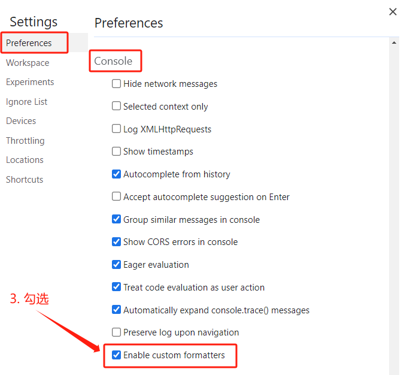

# ref 与 reactive

## ref 全家桶

### ref

作用：为**基本类型**的数据添加响应式。

语法：`const xxx = ref(初始值)`。

返回值：一个 `RefImpl` 的实例对象，简称 ref 对象，ref 对象的 **`value` 属性是响应式的**。

注意点：
- `JS` 中访问数据需要 `xxx.value`，但模板中不需要 `.value`，直接使用即可，因为模板中会自动“解包”；
- 对于 `const name = ref('张三')` 来说，`name` 不是响应式的，`name.value` 才是响应式的。

```html
<template>
  <h2>姓名：{{ name }}</h2>
  <h2>年龄：{{ age }}</h2>
  <button @click="changeName">修改名字</button>
  <button @click="changeAge">年龄+1</button>
  <button @click="showTel">点我查看联系方式</button>
</template>

<script setup lang="ts">
  import { ref } from 'vue'

  // name 和 age 是一个 RefImpl 的实例对象，简称 ref 对象，它们的 value 属性是响应式的
  const name = ref('张三')
  const age = ref(18)
  // tel 就是一个普通的字符串，不是响应式的
  const tel = '13888888888'

  function changeName() {
    // JS 中操作 ref 对象时需要 .value
    name.value = '李四'

    // 注意：name 不是响应式的，name.value 才是响应式的，所以如下代码并不会引起页面的更新
    // name = ref('李四')
  }
  function changeAge() {
    // JS 中操作 ref 对象时需要 .value
    age.value += 1
  }
  function showTel() {
    alert(tel)
  }
</script>
```

### isRef

用于判断一个值是不是 `ref` 对象。

```ts
import { ref, Ref, isRef } from 'vue'

const message1: Ref<string | number> = ref('Hello World')
const message2: number = 123

const changeMsg = () => {
  message1.value = '你好世界'
  console.log(isRef(message1))  // true
  console.log(isRef(message2))  // false
}
```

### ref 控制台小妙招

在控制台查看输出的 `ref` 对象很不方便，可以点击控制台右上角的“设置”，勾选“启用自定义格式设置工具”。




刷新浏览器，现在控制台输出的值就很明了。


### shallowRef

创建“浅层”的 `ref` 响应式对象，只有 `.value` 属性是响应式的，`.value` 中的值不是响应式的。

```ts
import { Ref, shallowRef } from 'vue'

interface Obj {
  name: string
}

const person: Ref<Obj> = shallowRef({
  name: '张三'
})

const changePerson = () => {
  // 无法对 name 属性进行修改，因为用的是 shallowRef，name 属性没有响应式
  // person.value.name = '李四'
  
  // 但可以对 .value 进行修改，因为 .value 是响应式的
  person.value = { name: '李四' }
}
```

`shallowRef()` 常用于对大型数据结构的性能优化，减少大型不可变结构的响应性开销。

### triggerRef

对于 `shallowRef`，修改 `.value` 中的值不会引起页面更新，因为它不是响应式的。但可以使用 `triggerRef` 进行强制更新。

```ts
import { Ref, shallowRef, triggerRef } from 'vue'

interface Obj {
  name: string
}

const person: Ref<Obj> = shallowRef({
  name: '张三'
})

const changePerson = () => {
  // name 属性的值在内存中被修改了，但是无法对视图进行更新，因为用的是 shallowRef，name 属性没有响应式
  person.value.name = '李四'
  // 在对 person 进行修改后，使用 triggerRef，可以强制更新 person 对应的视图
  triggerRef(person)
}
```

### shallowRef 与 ref

同时修改 `shallowRef()` 与 `ref()` 定义的数据，`shallowRef()` 的数据也会改变。

```ts
import { ref, shallowRef } from 'vue'

const p1 = ref({ name: '张三' })
const p2 = shallowRef({ name: '李四' })

const handleChange = () => {
  p1.value.name = '张三123'
  // p2 的 name 本来是改不了的，因为它是 shallowRef 定义的
  // 但由于这个方法中也修改了 p1，p1 是 ref 定义的，ref 底层也是调用 triggerRef 更新视图的
  // 所以 p2 也被一起修改了
  p2.value.name = '李四123'
}
```

### customRef

用于创建一个自定义的 `ref`，并对其依赖的数据进行跟踪（track）和更新触发（trigger）进行逻辑控制。

`customRef` 是一个函数，接受 `track`、`trigger` 两个函数作为参数，返回一个包含 getter、setter 的对象。

```html title="实现防抖效果"
<script setup lang="ts">
import { customRef } from 'vue'

// 自定义 myRef
function myRef<T, K>(value: T, delay: K) {
  let timer
  // 通过 customRef 去实现自定义
  return customRef((track, trigger) => {
    return {
      get() {
        track()   // 告诉 Vue 这个依赖的值（value）是需要被“追踪”的（追踪其变化）
        return value
      },
      set(newValue) {
        clearTimeout(timer)
        timer = setTimeout(() => {
          value = newValue
          trigger()   // 告诉 Vue 去更新界面
        }, delay)
      }
    }
  })
}

const keyword = myRef('hello', 500)
</script>

<template>
  <input v-model="keyword" type="text">
  <h3>{{ keyword }}</h3>
</template>
```

### ref 标识

用在普通 DOM 标签上，获取的是 DOM 节点；用在组件标签上，获取的是组件实例对象。

```html title="用在普通 DOM 标签上"
<template>
  <!-- 使用 ref 给元素打“标识” -->
  <h1 ref="title" id="title">HTML</h1>
  <button @click="showLog">点我打印内容</button>
</template>

<script setup lang="ts">
  import { ref } from 'vue'

  // 变量名必须与模板中的 ref 的值保持一致
  // ref 也可以接受一个泛型，否则会被推断为 any
  const title = ref<HTMLElement>()

  function showLog() {
    // 通过 id 获取元素
    // 注意，如果其他组件中也有相同 id 元素，那么可能无法正确获取当前组件的 id 元素
    const title = document.getElementById('title')
    console.log((title as HTMLElement).innerText)
    console.log((<HTMLElement>title).innerText)
    console.log(title?.innerText)

    // 通过 ref 获取元素
    console.log(title.value)  // 通过 .value 获取 DOM 元素，因为 title 是一个 ref 对象
  }
</script>
```

```html title="用在组件标签上"
<!-- 父组件 -->
<template>
  <Person ref="ren" />
  <button @click="test">测试</button>
</template>

<script setup lang="ts">
  import { ref } from 'vue'
  import Person from './components/Person.vue'

  const ren = ref()

  function test() {
    console.log(ren.value.name)
    console.log(ren.value.age)
  }
</script>

<!-- 子组件中要使用 defineExpose 暴露内容 -->
<script setup lang="ts" name="Person">
  import { ref } from 'vue'
  
  const name = ref('张三')
  const age = ref(18)
  
  // 使用 defineExpose 将组件中的数据交给外部
  defineExpose({ name, age })
</script>
```

## reactive 全家桶

### reactive

作用：为**复杂类型**的数据添加响应式（基本类型不要用它，要用 `ref`，否则报错）。

语法：`const xxx = reactive(源对象)`。

返回值：一个 `Proxy` 的实例对象，简称“响应式对象”。

注意点：
- `reactive` 定义的响应式数据是“深层次”的；
- `ref` 可以为任意类型的数据添加响应式，如果是复杂类型的数据，`ref` 底层其实也是调用的 `reactive`。

```html
<template>
  <h2>汽车信息：一台{{ car.brand }}汽车，价值{{ car.price }}万</h2>
  <h2>游戏列表：</h2>
  <ul>
    <li v-for="g in games" :key="g.id">{{ g.name }}</li>
  </ul>
  <h2>测试：{{ obj.a.b.c.d }}</h2>
  <button @click="changeCarPrice">修改汽车价格</button>
  <button @click="changeFirstGame">修改第一个游戏</button>
  <button @click="test">测试</button>
</template>

<script setup lang="ts">
  import { reactive } from 'vue'
  
  let car = reactive({ brand: '奔驰', price: 100 })
  let games = reactive([
    { id: 'ahsgdyfa01', name: '英雄联盟' },
    { id: 'ahsgdyfa02', name: '王者荣耀' },
    { id: 'ahsgdyfa03', name: '原神' }
  ])
  let obj = reactive({      // reactive 定义的响应式数据是深层次的
    a: {
      b: {
        c: {
          d: 666
        }
      }
    }
  })

  function changeCarPrice() {
    car.price += 10
  }
  function changeFirstGame() {
    games[0].name = '流星蝴蝶剑'
  }
  function test() {
    obj.a.b.c.d = 999
  }
</script>
```

### shallowReactive

创建“浅层”的 `Proxy` 响应式对象，只有第一层的属性是响应式的，第二层及更深层次的属性不是响应式的。

```ts
import { shallowReactive } from 'vue'

const state = shallowReactive({
  a: 1,
  first: {
    b: 2,
    second: {
      c: 3
    }
  }
})

const change = () => {
  // 第一层的数据可以修改，会更新视图
  state.a = 2
  // 第二层的数据只会在内存中修改，不会更新视图
  state.first.b = 3
}
```

:::info[引用]
通过使用 [`shallowRef()`](https://cn.vuejs.org/api/reactivity-advanced.html#shallowref) 和 [`shallowReactive()`](https://cn.vuejs.org/api/reactivity-advanced.html#shallowreactive) 来绕开深度响应。浅层式 API 创建的状态只在其顶层是响应式的，对所有深层的对象不会做任何处理，避免了对每一个内部属性做响应式所带来的性能成本，这使得属性的访问变得更快，可提升性能。
:::

### 数组异步赋值问题

以下代码，对响应式的对象直接赋值，这样会导致该数据失去响应式。虽然数据在内存中会被修改，但视图不会更新。

```ts
import { reactive } from 'vue'

let arr = reactive([1, 2, 3])

setTimeout(() => {
  // highlight-start
  arr = [4, 5, 6]
  // arr = reactive([4, 5, 6])   // 即使是赋值为一个新的 reactive 响应式对象，页面也不会更新
  // highlight-end
  console.log('arr:', arr)  // [4, 5, 6]
}, 1000)
```

```ts title="解决方案1：使用数组的方法"
import { reactive } from 'vue'

let arr = reactive([1, 2, 3])

setTimeout(() => {
  // highlight-next-line
  arr.push(...[4, 5, 6])
}, 1000)
```

```ts title="解决方案2：包装在一个对象中"
import { reactive } from 'vue'

let data = reactive({
  arr: [1, 2, 3]
})

setTimeout(() => {
  // highlight-next-line
  data.arr = [4, 5, 6]
}, 1000)
```

```ts title="解决方案3：Object.assign()"
import { reactive } from 'vue'

let arr = reactive([1, 2, 3])

setTimeout(() => {
  // highlight-next-line
  Object.assign(arr, [4, 5, 6])
}, 1000)
```

## ref 对比 reactive

`ref` 可以用来定义**基本类型数据**、**对象类型数据**，而 `reactive` 只能用来定义**对象类型数据**。

若 `ref` 接收的是对象类型，底层其实也是调用了 `reactive` 实现响应式。

访问 `ref` 创建的变量必须使用 `.value`（可以使用 `volar` 插件自动添加 `.value`）。

`reactive` 如果重新分配一个新对象，会**失去**响应式（可以使用 `Object.assign` 去整体替换）。

使用原则：
- 若需要一个基本类型的响应式数据，必须使用 `ref`；
- 若需要一个响应式对象，层级不深，`ref`、`reactive` 都可以；
- 若需要一个响应式对象，且层级较深，推荐使用 `reactive`。

```ts
import { ref } from 'vue'

let car = ref({ brand: '奔驰', price: 100 })
let games = ref([
  { id: 'ahsgdyfa01', name: '英雄联盟' },
  { id: 'ahsgdyfa02', name: '王者荣耀' },
  { id: 'ahsgdyfa03', name: '原神' }
])
// 即使是用 ref 定义深层次的对象，对象的响应式也是深层次的
// 因为 ref 底层也是调用 reactive 实现响应式
let obj = ref({
  a: {
    b: {
      c: {
        d: 666
      }
    }
  }
})

// 用 ref 定义的复杂类型的数据，在 JS 中要 .value
function changeCarPrice() {
  car.value.price += 10
}
function changeFirstGame() {
  games.value[0].name = '流星蝴蝶剑'
}
```

```ts title="以下对 ref 和 reactive 定义的数据修改的方式，都是不生效的！"
import { ref, reactive } from 'vue'

let sum = ref(0)
let car = reactive({ brand: '奔驰', price: 100 })

function changeSum() {
  // 修改 ref 定义的数据，要通过 .value
  sum = ref(9)
}

function changeCar() {
  // 修改 reactive 定义的数据，可以使用 Object.assign()
  // 或者修改其中的属性，如 car.brand、car.price
  car = reactive({ brand: '奥迪', price: 200 })
}
```

## reactive 中使用 ref

如果是自己使用 `ref` 定义的响应式数据，在 JS 中需要 `.value` 获取值。

```ts
const n = ref(123)
console.log(n.value)
```

如果 `ref` 定义的数据是在 `reactive` 中的，获取值时不用 `.value`，会自动解包。

```ts
const n = reactive({
  a: 1,
  b: 2,
  c: ref(3)
})
console.log(n.a)  // 1
console.log(n.b)  // 2
console.log(n.c)  // 3
console.log(n.c.value)  // undefined
```
