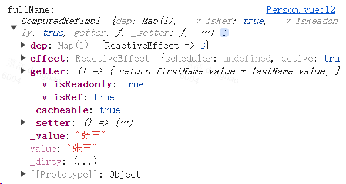

# computed 与 watch

## computed

```ts title="函数形式"
import { ref, Ref, computed } from 'vue'

const firstName: Ref<string> = ref('张')
const lastName: Ref<string> = ref('三')

const fullName = computed<string>(() => {
  return firstName.value + '-' + lastName.value
})
```

```ts title="对象形式"
import { ref, computed } from 'vue'

const firstName = ref('张')
const lastName = ref('三')

const fullName = computed({
  get() {
    return firstName.value + '-' + lastName.value
  },
  set(value) {
    const nameArr = value.split('-')
    firstName.value = nameArr[0]
    lastName.value = nameArr[1]
  }
})
```

函数式写法无法修改计算属性的值，因为只有 getter 没有 setter。如果要对计算属性进行修改，可以使用对象写法。

`computed` 函数的返回值是一个**计算属性 ref（ComputedRefImpl）**，所以 JS 中获取计算属性的值需要 `.value`，模板中可以直接使用。



## watch

`watch` 函数接收三个参数：监听源、回调函数、配置对象（包含 `immediate`、`deep`）。

`watch` 函数的返回值是一个停止监听的函数，用来取消对数据的监视。

Vue3 中的 `watch` 只能监视以下数据：
- `ref`、`reactive` 定义的数据；
- 一个函数，返回一个值（getter 函数）；
- 一个包含上述内容的数组。

### 监视 `ref` 定义的基本类型数据

监视 `ref` 定义的【基本类型】数据，直接写数据名即可，监视的是其 `value` 值的改变。

```ts
import { ref, watch } from 'vue'

let sum = ref(0)

const stopWatch = watch(sum, (newValue, oldValue) => {
  if (newValue >= 10) {
    stopWatch()
  }
})
```

:::warning
监视 `ref` 定义的基本类型的数据，不用 `.value`，因为 `.value` 已经获取到具体的值了，`watch` 只能监视属性或变量的变化，而不能监视具体的值。
:::

### 监视 `ref` 定义的对象类型数据

监视 `ref` 定义的【对象类型】数据，直接写数据名，监视的是对象的【地址值】，若想监视对象内部的数据，要手动开启深度监视，或使用 `.value`。

注意：
- 若修改的是 `ref` 定义的对象中的某个属性，`newValue` 和 `oldValue` 都是新值，因为它们是同一个对象（对象引用地址未发生改变）；
- 若修改整个 `ref` 定义的对象，`newValue` 是新值，`oldValue` 是旧值，因为不是同一个对象了（对象引用地址发生了变化）。

:::warning
监视 `ref` 定义的复杂类型的数据：
- 如果监视的是整个对象是否发生变化（对象的引用地址是否发生变化），那就不用 `.value`；
- 如果监视的是对象中的某个属性：
    - 需要 `.value`，因为通过 `.value` 才能真正获取到源对象（此时监视的其实已经是 `reactive` 定义的数据了）；
    - 如果不使用 `.value`，可以开启深度监视。
:::

```ts
import { ref, watch } from 'vue'

const person = ref({ name: '张三', age: 18 })

// 监视 person 对象的引用地址，即监视整个对象是否发生变化
watch(person, (newValue, oldValue) => {
  // 当 person 的引用地址发生变化，newValue 和 oldValue 已经不一样了
  console.log(newValue === oldValue)    // false
})

// 开启深度监视，监视 person 对象及其中的属性
watch(person, (newValue, oldValue) => {
  // 如果只是对象中的属性值发生变化，而对象的引用地址没有发生变化，那么 newValue 和 oldValue 仍然是同一个对象
  console.log(newValue === oldValue)    // true
}, { deep: true })

// 通过 .value，监视 person 对象中的属性
// 由于 ref 借助了 reactive 实现响应式，所以这里监视的 person.value 其实已经是在监视 reactive 定义的数据了
// 而监视 reactive 定义的数据，默认就开启了深度监视，所以这里就会监视 person.value 中的所有属性
// 注意：这种方式不会监视 person 对象，所以当 person 对象引用地址发生变化时，不会执行回调
// 且之后对于 person 对象及其属性发生的变化都监视不到
watch(person.value, (newValue, oldValue) => {
  console.log(newValue === oldValue)    // true
})
```

### 监视 `reactive` 定义的对象类型数据

监视 `reactive` 定义的【对象类型】数据，默认就开启了深度监视，且无法关闭。

所以它监视的是对象中的属性，而不是对象的地址值。

```ts
import { reactive, watch } from 'vue'

let obj = reactive({
  a: {
    b: {
      c: 666
    }
  }
})

watch(obj, (newValue, oldValue) => {
  // reactive 定义的数据，可以修改其中的属性，通过 Object.assign() 方法也是修改其中的属性
  // 而无法给它赋值新对象，这意味着对象的引用地址不会被改变
  // 所以 newValue 和 oldValue 都是同一个对象
  console.log(newValue === oldValue)    // true
}, { deep: false })   // 无法关闭深度监视
```

### 监视 `ref` 或 `reactive` 定义的对象类型数据中的某个属性

监视 `ref` 或 `reactive` 定义的【对象类型】数据中的**某个属性**，注意点如下：

1. 若该属性值**不是**【对象类型】，需要写成函数形式；
2. 若该属性值**是**【对象类型】，可以直接写，也可以写成函数形式，建议写成函数形式。

结论：监视的如果是对象里的某个属性，那么最好写函数形式。

注意点：如果属性值也是对象，那么监视的是地址值；如果要监视这个对象的内部属性，需要手动开启深度监视。

```ts
import { reactive, watch } from 'vue'

let person = reactive({
  name: '张三',
  age: 18,
  car: {
    c1: '奔驰',
    c2: '宝马'
  }
})

// 监视响应式对象中的某个属性，且该属性是基本类型的，要写成函数式
watch(() => person.name, (newValue, oldValue) => {
  console.log(newValue === oldValue)    // false
})

// 监视响应式对象中的某个属性，且该属性是对象类型的，可以直接写，也可以写成函数式，更推荐写函数式
// 默认监视的是 person.car 整个对象的变化（监视的是地址值）
watch(() => person.car, (newValue, oldValue) => {
  // 如果没有开启深度监视，那么监视的就是 person.car 的地址值
  // 如果开启了深度监视，那么监视的就是 person.car 中的属性
  console.log(newValue === oldValue)    // false or true
}, { deep: true })    // 也可以对 person.car 进行深度监视，监视对象内部的属性
```

### 监视上述的多个数据

```ts
import { reactive, watch } from 'vue'

let person = reactive({
  name: '张三',
  age: 18,
  car: {
    c1: '奔驰',
    c2: '宝马'
  }
})

// 监视上述的多个数据
watch([() => person.name, person.car], (newValue, oldValue) => {
  // 此时 newValue、oldValue 是一个数组
  console.log('person.car变化了', newValue, oldValue)
}, { deep: true })
```

## watchEffect

### 基本使用

执行时机：
- `watchEffect` 一上来就默认调用一次，相当于 `watch` 设置了 `immediate: true`；
- 当依赖的数据发生变化，重新调用。

`watch` 与 `watchEffect` 都能监听响应式数据的变化，不同的是监听数据变化的方式不同。`watch` 要明确指出监视的数据，而 `watchEffect` 不用明确指出监视的数据（函数中用到哪些属性，就监视哪些属性）。

`watchEffect` 有点像 `computed`：
- 但 `computed` 注重的是计算出来的值（回调函数的返回值），所以必须要写返回值；
- 而 `watchEffect` 更注重的是过程（回调函数的函数体），所以不用写返回值。

```ts
import { ref, watch, watchEffect } from 'vue'

let temp = ref(0)
let height = ref(0)
let person = reactive({ name: '张三', age: 18 })

// 用 watch 实现，需要明确的指出要监视 temp、height
watch([temp, height], (value) => {
  // 从 value 中获取最新的 temp、height
  const [newTemp, newHeight] = value
  if (newTemp >= 50 || newHeight >= 20) {
    console.log('联系服务器')
  }
})

// 用 watchEffect 实现，不用明确指出要监视哪些数据（用到哪些数据就监视哪些数据）
const stopWtach = watchEffect(() => {   // 回调函数不接收 newValue、oldValue 参数
  const x2 = person.age   // person.name 发生变化时，不触发回调
  console.log(x2)
  if (temp.value >= 50 || height.value >= 20) {
    console.log('联系服务器')
  }
  if (temp.value === 100 || height.value === 50) {
    stopWtach()
  }
})
```

### 清除副作用

```ts
import { watchEffect, ref } from 'vue'

let message = ref<string>('')
let message2 = ref<string>('')

watchEffect(oninvalidate => {
  console.log('message', message.value)
  // 触发监听之前会先调用这个函数
  oninvalidate(() => {

  })
  console.log('message2', message2.value)
})
```

### 停止监听

```ts
import { watchEffect, ref } from 'vue'

let message = ref<string>('')
let message2 = ref<string>('')

const stop = watchEffect(oninvalidate => {
  console.log('message', message.value)
  oninvalidate(() => {

  })
  console.log('message2', message2.value)
}, {
  // flush 可以设置侦听器执行时机
  //    pre：侦听器将在组件更新之前执行（默认）
  //    post：侦听器将在组件更新之后执行
  //    sync：同步触发
  flush: 'post',
  onTrigger() {   // 可以帮助我们调试 watchEffect
    debugger
  }
})

// 调用 watchEffect 返回的函数，会停止监听
stop()
```
