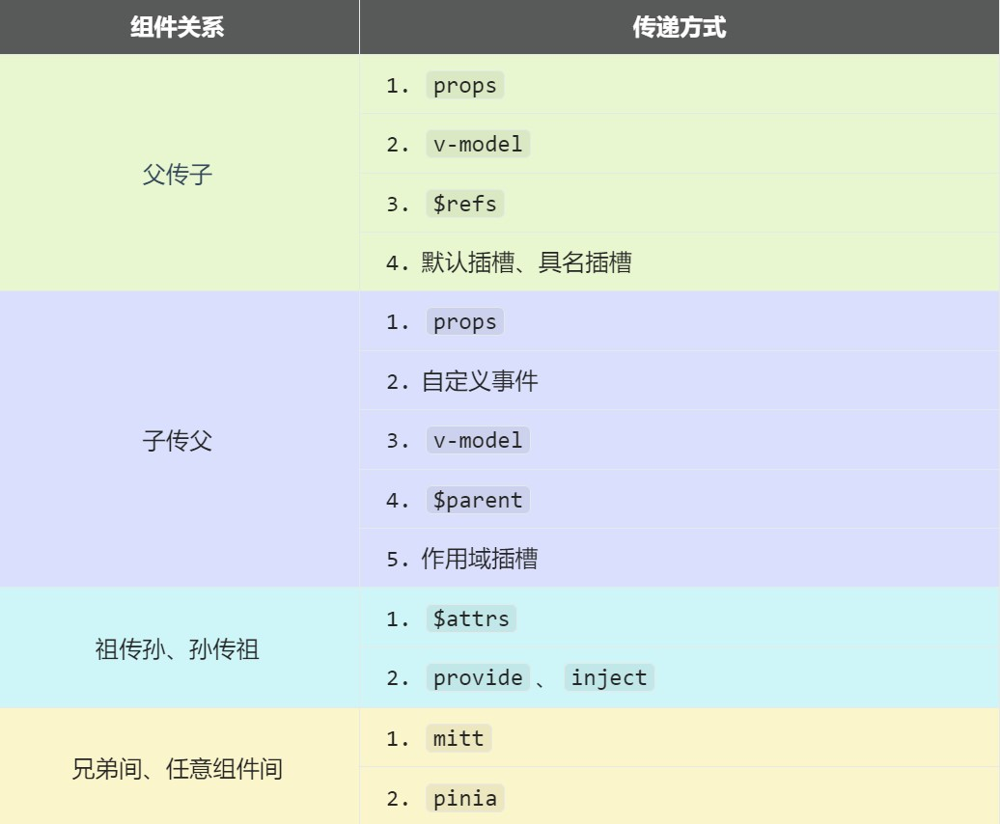

# 组件通信

Vue3 组件通信和 Vue2 的区别：

- 移除事件总线，使用 `mitt` 代替；
- Vuex 换成了 Pinia；
- 把 `.sync` 优化到了 `v-model` 里面；
- 把 `$listeners` 所有的东西，合并到 `$attrs` 中；
- `$children` 被移除。

常见搭配形式：



## 父子组件通信

### props

`props` 可用于 **父 => 子** 传递数据，也可用于 **子 => 父** 传递数据。

- **父 => 子**：父组件通过绑定 `props` 向子组件传递数据，子组件通过 `defineProps` 接收数据。
- **子 => 父**：父组件通过 `props` 向子组件传递一个函数，子组件通过 `defineProps` 接收该函数，那么子组件中就可以调用该函数并传递参数，实现子向父通信。

```ts title="src/types/index.ts"
// 定义一个接口，限制每个 Person 对象的格式
export interface PersonInter {
  id: string
  name: string
  age: number
}

// 定义一个自定义类型 Persons
export type Persons = Array<PersonInter>
```

```html title="父组件"
<template>
  <Person :list="persons" :addPerson="addPerson" />
</template>

<script setup lang="ts">
  import { reactive } from 'vue'
  import { type PersonInter, type Persons } from './types'
  import Person from './components/Person.vue'

  // reactive 接收一个泛型
  const persons = reactive<Persons>([
    { id: 'e98219e12', name: '张三', age: 18 },
    { id: 'e98219e13', name: '李四', age: 19 },
    { id: 'e98219e14', name: '王五', age: 20 }
  ])
  
  function addPerson(person: PersonInter) {
    persons.push(person)
  }
</script>
```

```html title="子组件 Person.vue"
<template>
  <ul>
    <!-- 模板中可以直接使用 props 中的属性 -->
    <li v-for="item in list" :key="item.id">
      {{ item.name }}--{{ item.age }}
    </li>
  </ul>
  <button @click="addPerson">add</button>
</template>

<script setup lang="ts">
  // defineProps 无须引入，直接使用即可
  const props = defineProps(['list', 'addPerson'])
  // JS 中需要通过 props 变量才能访问到其中的属性
  console.log(props.list)
  
  function addPerson() {
    props.addPerson({ id: 'e98219e15', name: '赵六', age: 30 })
  }
</script>
```

```html title="如果用的是 TS，defineProps 的使用方式"
<script setup lang="ts">
import { type Persons } from './types'
   
// defineProps 可以接收一个泛型，用于限制类型
const props = defineProps<{
  title: string,    // title 属性是必传的
  list?: Persons    // list 属性是可选的
}>()
</script>
```

```html title="TS 设置默认值的方式"
<script setup lang="ts">
type Props = {
  title?: string,
  list?: Persons
}

// withDefaults 也无需引入，直接使用即可
// withDefaults 的第一个参数是 defineProps，第二个参数是默认值对象
const props = withDefaults(defineProps<Props>(), {
  title: '张三',
  // 注意，复杂类型数据的默认值需要通过函数返回
  list: () => [{ id: '001', name: '小猪佩奇', age: 18 }]
})
</script>
```

### 自定义事件

子组件通过 `defineEmits` 派发一个自定义事件，父组件通过 `@` 监听该事件，实现 **子 => 父** 通信。

注意区分原生事件与自定义事件：
- 原生事件的事件对象 `$event`：是包含事件相关信息的对象（`pageX`、`pageY`、`target`、`keyCode` 等）；
- 自定义事件的事件对象 `$event`：是调用 `emit` 时所提供的数据，可以是任意类型。

```html title="子组件"
<template>
  <button @click="clickTap">派发给父组件</button>
</template>

<script setup lang="ts">
import { reactive } from 'vue'

// const emit = defineEmits(['on-click'])

// TS 的形式
const emit = defineEmits<{
    (e: 'on-click', name: string): void  // 第一个参数是事件名，后面的参数是正常传参
}>()

const list = reactive<number[]>([4, 5, 6])

const clickTap = () => {
  emit('on-click', list)
}
</script>
```

```html title="父组件"
<template>
  <!-- 在父组件中，给子组件绑定自定义事件 -->
  <Menu @on-click="getList"></Menu>

  <!-- 注意区分原生事件与自定义事件中的 $event -->
  <button @click="toy = $event">测试</button>
</template>
 
<script setup lang="ts">
import Menu from './Menu/index.vue'
 
const getList = (list: number[]) => {
  console.log('父组件接受子组件传过来的数据：', list)
}
</script>
```

:::tip
Vue 文档推荐自定义事件名始终使用短横线命名方式，而不是使用小驼峰或大驼峰的命名方式。
:::

### v-model

实现 **父 ↔ 子** 之间相互通信。

`v-model` 写在普通的 HTML 标签上，其本质是：`:value` 属性 ＋ `@input` 事件。

```html title="HTML 标签上使用 v-model"
<input type="text" v-model="userName">

<!-- v-model 的本质是下面这行代码 -->
<input type="text" :value="userName" @input="userName = (<HTMLInputElement>$event.target).value">
```

`v-model` 写在组件标签上，其本质是：`:moldeValue` 属性 ＋ `@update:modelValue` 事件。

```html title="组件标签上使用 v-model"
<AtguiguInput v-model="userName" />

<!-- 组件标签上 v-model 的本质 -->
<AtguiguInput :modelValue="userName" @update:model-value="userName = $event" />
```

```html title="AtguiguInput 组件"
<template>
  <input type="text" :value="modelValue" @input="emit('update:model-value', $event.target.value)">
</template>

<script setup lang="ts">
  // 接收 props
  defineProps(['modelValue'])
  // 声明事件
  const emit = defineEmits(['update:model-value'])
</script>
```

Vue3 中，在组件标签上可以写多个 `v-model`。

```html
<!-- 也可以更换 value，例如改成 abc -->
<AtguiguInput v-model:abc="userName" v-model:xyz="password" />

<!-- 上面代码的本质如下 -->
<AtguiguInput :abc="userName" @update:abc="userName = $event"/>
```

```html title="AtguiguInput 组件"
<template>
  <input type="text" :value="abc" @input="emit('update:abc', $event.target.value)">
  <input type="password" :value="xyz" @input="emit('update:xyz', $event.target.value)">
</template>

<script setup lang="ts">
  // 接收 props
  defineProps(['abc', 'xyz'])
  // 声明事件
  const emit = defineEmits(['update:abc', 'update:xyz'])
</script>
```

### $refs、$parent

`$refs` 用于 **父→子**，`$parent` 用于**子→父**。

| 属性        | 说明                                 |
|-----------|------------------------------------|
| `$refs`   | 值为对象，包含所有被 `ref` 属性标识的 DOM 元素或组件实例 |
| `$parent` | 值为对象，当前组件的父组件实例对象                  |

```html
<template>
  <Child1 ref="child1Ref"/>
  <Child2 ref="child2Ref"/>
  <button @click="getChildren($refs)">getChildren</button>
  <button @click="getParent($parent)">getParent</button>
</template>

<script setup lang="ts">
  import { ref } from 'vue'

  const child1Ref = ref()
  const child2Ref = ref()

  function getChildren(refs) {
    console.log(refs)
  }
  function getParent(parent) {
    console.log(parent)
  }
</script>
```

注意，通过 `$refs` 访问子组件实例或通过 `$parent` 访问父组件实例时，如果要操作子组件或父组件中的数据或方法，需要子组件或父组件使用 `defineExpose()` 暴露出来。

### 插槽

[Vue 插槽详解](https://dongdong12138.github.io/blog/vue-slot)

## 祖孙组件通信

### $attrs

`$attrs` 用于实现**当前组件的父组件**，向**当前组件的子组件**通信（**祖→孙**）。如果祖组件传递一个函数给孙组件，孙组件调用该函数，也可实现**孙→祖**。

使用场景：组件的二次封装，二次封装的组件需要支持原组件的所有属性。

具体说明：
- `$attrs` 是一个对象，包含所有父组件传入的标签属性；
- `$attrs` 会自动排除 `props` 中声明的属性（可以认为声明过的 `props` 被子组件自己“消费”了）。

```html title="父组件"
<template>
  <Child :a="a" :b="b" :c="c" :d="d" v-bind="{x: 100, y: 200}" :updateA="updateA"/>
</template>

<script setup lang="ts">
  import { ref } from 'vue'
  import Child from './Child.vue'

  let a = ref(1)
  let b = ref(2)
  let c = ref(3)
  let d = ref(4)

  function updateA(value) {
    a.value = value
  }
</script>
```

```html title="子组件"
<template>
  <GrandChild v-bind="$attrs"/>
</template>

<script setup lang="ts">
  import GrandChild from './GrandChild.vue'
</script>
```

```html title="孙组件"
<template>
  <h4>a：{{ a }}</h4>
  <h4>b：{{ b }}</h4>
  <h4>c：{{ c }}</h4>
  <h4>d：{{ d }}</h4>
  <h4>x：{{ x }}</h4>
  <h4>y：{{ y }}</h4>
  <button @click="updateA(666)">点我更新A</button>
</template>

<script setup lang="ts">
  defineProps(['a', 'b', 'c', 'd', 'x', 'y', 'updateA'])
</script>
```

:::tip
在组件上使用 `v-bind` 绑定一个对象，会将对象中的属性和方法，全部传递给组件。
:::

### provide、inject

可实现**祖孙组件**直接通信：
- 在祖先组件中通过 `provide` 向后代组件提供数据或方法；
- 在后代组件中通过 `inject` 来声明接收（注入）数据或方法。

```html title="父组件中，使用 provide 提供数据"
<template>
  <h4>资产：{{ money }}</h4>
  <h4>汽车：{{ car }}</h4>
  <button @click="money += 1">资产+1</button>
  <button @click="car.price += 1">汽车价格+1</button>
  <Child />
</template>

<script setup lang="ts">
  import { ref, reactive, provide } from 'vue'
  import Child from './Child.vue'

  let money = ref(100)
  let car = reactive({
    brand: '奔驰',
    price: 100
  })

  function updateMoney(value: number) {
    money.value += value
  }

  // 如果传递 money.value，那就是传递的具体的值，会导致 money 失去响应式
  // 当 money 更新时，后代组件使用到 money 的地方都不会随之更新
  // provide('moneyContext', { money: money.value, updateMoney })

  // 所以要传递 money，这样传递的才是 ref 对象，才具有响应式
  provide('moneyContext', { money, updateMoney })
  provide('car', car)
</script>
```

```html title="后代组件中使用 inject 接收数据"
<template>
  <h4>资产：{{ money }}</h4>
  <h4>汽车：{{ car }}</h4>
  <button @click="updateMoney(6)">点我</button>
</template>

<script setup lang="ts">
  import { inject } from 'vue'
  
  // inject 的第二个参数是默认值（如果 TS 检查报错，可以通过指定默认值的方式告诉 TS 如何推断）
  let { money, updateMoney } = inject('moneyContext', {
    money: 0,
    updateMoney: (x: number) => ({})
  })
  let car = inject('car')
</script>
```

## 兄弟组件、任意组件通信

### mitt

在 Vue3 中，`$on`、`$off`、`$once` 实例方法已被移除，组件实例不再实现事件触发接口，因此大家熟悉的 EventBus 便无法使用了，我们可以使用 `mitt` 库来替代。

`mitt` 与消息订阅与发布（`pubsub`）功能类似，可以实现任意组件间通信。

```shell title="安装"
npm i mitt
```

```ts title="src\utils\emitter.ts"
// 引入 mitt
import mitt from 'mitt'

// 创建 emitter
const emitter = mitt()

// 向外暴露 mitt
export default emitter
```

```ts title="接收数据的组件"
import { onUnmounted } from 'vue'
import emitter from '@/utils/emitter'

// 绑定事件
emitter.on('send-toy', (value) => {
  console.log('send-toy事件被触发', value)
})

onUnmounted(() => {
  // 解绑事件
  emitter.off('send-toy')
})
```

```ts title="提供数据的组件"
import emitter from '@/utils/emitter'

function sendToy() {
  // 触发事件
  emitter.emit('send-toy', toy.value)
}
```

其他用法：[小满Vue3（Mitt）](https://xiaoman.blog.csdn.net/article/details/125453908)

### Pinia

Pinia 是一个状态管理库，可以代替 Vuex 来实现组件间通信。

[//]: # (TODO 待补充跳转链接)
