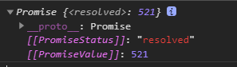
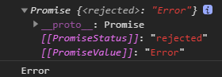
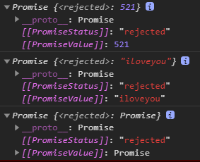
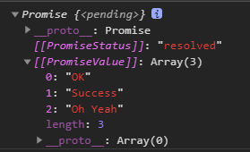
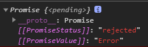
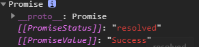
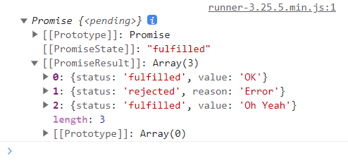
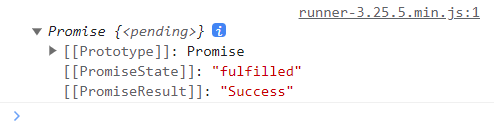
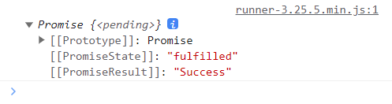
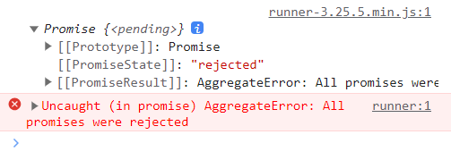

# Promise 的理解和使用

## Promise 是什么

### 理解 Promise

Promise 是 JS 中进行异步编程的新的解决方案（旧方案是单纯使用回调函数）。

promise 对象用来封装一个异步操作（如 Ajax、定时器、fs 文件操作等），并可以获取这个异步任务成功或失败的结果。

具体使用就是，我们 `new Promise` 构造函数，得到一个 promise 实例对象，通过 promise 对象我们可以使用 `then`、`catch` 等方法。

### Promise 的状态

实例对象 promise 中的一个属性 `PromiseState`，表示 Promise 的状态。

- 一个 Promise 刚被 new 出来的时候，状态是 `pending`（未确定的）；
- 异步任务成功，状态从 `pending` 变为 `resolved`/`fullfilled`；
- 异步任务失败，状态从 `pending` 变为 `rejected`。

注意：

- promise 对象的状态不受外界影响；
- Promise 状态只有这三种，且一个 promise 对象的状态只能改变一次；
- 一旦状态改变，就不会再变，任何时候都可以得到这个结果；
- 无论成功还是失败，都会有一个结果数据。成功的结果数据一般称为 `value`，而失败的结果一般称为 `reason`。

### Promise 对象的值

实例对象 promise 的另一个属性 `PromiseResult`，保存着对象成功（`value`）或失败（`reason`）的值。

### Promise 的基本流程


- `new Promise()` 中接收一个回调函数作为参数，在回调函数中执行异步操作；
- `then()` 可以指定成功或者失败的回调函数，`catch()` 只能指定失败的回调函数；
- `then()`、`catch()` 都会返回一个新的 promise 对象。

### Promise 的基本使用

```js
const promise = new Promise(function (resolve, reject) {    // 执行器函数
  // 执行器回调中做异步操作
  if (异步操作成功) {
    resolve(value)
  } else {
    reject(reason)
  }
})
```

Promise 构造函数接受一个执行器函数作为参数，执行器函数的两个参数分别是 `resolve` 和 `reject`。它们是两个函数，由 JavaScript 引擎提供，不用自己部署。

- `resolve` 函数的作用是，将 Promise 对象的状态从“未完成”变为“成功”（即从 `pending` 变为 `resolved`），在异步操作成功时调用，并将成功的结果作为参数 `value` 传递出去；
- `reject` 函数的作用是，将 Promise 对象的状态从“未完成”变为“失败”（即从 `pending` 变为 `rejected`），在异步操作失败时调用，并将失败的原因或错误对象作为参数 `reason`/`error` 传递出去。

Promise 实例生成以后，可以用 `then` 方法分别指定 `resolved` 状态和 `rejected` 状态的回调函数。

```js
promise.then(function (value) {   // onResolved
  // success
}, function (reason) {            // onRejected
  // failure
})
```

`then` 方法可以接受两个回调函数作为参数：
- 第一个回调函数 `onResolved()`，是 Promise 对象的状态变为 `resolved` 时调用；
- 第二个回调函数 `onRejected()`，是 Promise 对象的状态变为 `rejected` 时调用；
- 这两个函数都是可选的，不一定要提供。它们都接受 Promise 对象传出的值作为参数。

```js title="完整代码"
const p = new Promise((resolve, reject) => {    // 执行器函数（同步回调）
  // 执行异步操作任务                                             
  setTimeout(() => {
    const time = Date.now()
    if (time % 2 == 0) {
      // 如果成功，调用 resolve(value)
      resolve('成功的数据，time=' + time)
    } else {
      // 如果失败，调用 reject(reason)
      reject('失败的数据，time=' + time)
    }
  }, 1000)
})

p.then(value => {   // 接收得到成功的 value 数据（onResolved）
  console.log('成功的回调', value)
}, reason => {      // 接收得到失败的 reason 数据（onRejected）
  console.log('失败的回调', reason)
})

// .then() 和执行器（executor）都是同步执行
// .then() 中的回调函数是异步执行
```

## 为什么要用 Promise

### 指定回调函数的方式更加灵活

旧的方式：回调函数必须在启动异步任务之前指定。

```js title="纯回调的形式"
// 成功的回调函数
function successCallback(result) {
  console.log('result:', result)
}
// 失败的回调函数
function failCallback(reason) {
  console.log('reason:', reason)
}

function request(success, fail) {
  setTimeout(() => {
    const timeStamp = new Date().getTime()
    if (timeStamp % 2 === 0) {
      success(timeStamp)
    } else {
      fail(timeStamp)
    }
  }, 2000)
}
// 必须先指定回调函数，再执行异步任务
request(successCallback, failCallback)
```

Promise：启动异步任务（异步任务还没有完成），就返回 promise 对象，然后给 promise 对象绑定回调函数（甚至可以在异步任务结束后指定）。

也就是说，这比纯回调的形式更加灵活，使用 Promise，回调函数可以在异步任务结束之前指定，也可以在异步任务结束之后指定。

```js
function successCallback(result) {
  console.log('result:', result)
}
function failCallback(reason) {
  console.log('reason:', reason)
}

const p = new Promise((resolve, reject) => {
  setTimeout(() => {
    const timeStamp = new Date().getTime()
    if (timeStamp % 2 === 0) {
      resolve(timeStamp)
    } else {
      reject(timeStamp)
    }
  }, 2000)
})

// 启动异步任务之前指定成功和失败的回调函数
p.then(successCallback, failCallback)

// 启动异步任务之后且异步任务返回结果之后，再指定成功和失败的回调函数
setTimeout(() => {
  p.then(successCallback, failCallback)
}, 3000)

// .then() 和执行器（executor）同步执行
// .then() 中的回调函数异步执行
```

### 支持链式调用，可以解决回调地狱问题

回调地狱：回调函数嵌套调用，外部回调函数异步执行的结果是其内部嵌套的回调函数执行的条件。

回调地狱的缺点：不便于阅读，不便于异常处理。

```js title="回调地狱"
doSomething(function (result) {
  doSomethingElse(result, function (newResult) {
    doThirdThing(result, newResult, function (finalResult) {
      console.log('Got the final result:' + finalResult)
    }, failureCallback)
  }, failureCallback)
}, failureCallback)
```

解决方案：

```js title="promise 链式调用（仍然需要写回调函数）"
doSomething()
  .then(result => {
    return doSomethingElse(result)
  })
  .then(newResult => {
    return doThirdThing(newResult)
  })
  .then(finalResult => {
    console.log('Got the final result:' + finalResult)
  })
  .catch(failureCallback)

// 只要有一个 .then() 里面的回调有异常，都会被最后的 catch 捕获到，这叫 “异常传透”
```

```js title="async/await（不用写回调函数）"
async function request() {
  try {
    const result = await doSomething()
    const newResult = await doSomethingElse(result)
    const finalResult = await doThirdThing(newResult)
    console.log('Got the final result:' + finalResult)
  } catch (error) {
    failureCallback(error)
  }
}
```

## 如何使用 Promise

### Promise 构造函数

Promise(executor) {}：

- `executor` 函数：执行器函数，通常写成 `(resolve, reject) => {}`，它是同步执行的。
  - `resolve` 函数：成功时调用的函数，通常写成 `resove(value)`；
  - `reject` 函数：失败时调用的函数，通常写成 `reject(reason)`。
- `executor` 是执行器，会在 Promise 内部立即同步执行；异步操作 `resolve`/`reject` 就在 `executor` 中执行。
- Promise 构造函数的方法有：`resolve`、`reject`、`all`、`race`、`allSettled` 等。
- promise 原型对象（`Promise.prototype`）上的方法有 `then`、`catch`、`finally` 等。

### Promise.prototype.then 方法

`then` 方法可以指定成功的回调和失败的回调。

语法：`p.then(onResolved, onRejected)`。
- `onResolved`：成功的回调，通常写成 `(value) => {}`；
- `onRejected`：失败的回调，通常写成 `(reason) => {}`。

返回值：返回一个新的 promise 对象。

```js
new Promise((resolve, reject) => {
  setTimeout(() => {
    resolve('成功')
    reject('失败')  // promise 的状态只能被更改一次，所以这里的 reject 是无效的
  }, 1000)
}).then(value => {
  console.log('value:', value)  // value: 成功
}, (reson) => {
  console.log('reson:', reson)  // 不会输出
})
```

### Promise.prototype.catch 方法

`catch` 方法用于指定失败的回调。

语法：`p.catch(onRejected)`。
- `onRejected` 函数：失败的回调，通常写成 `(reason) => {}`。

返回值：返回一个新的 promise 对象。

说明：
- 这是 `then()` 的语法糖，相当于 `then(undefined, onRejected)`；
- `catch` 除了可以用于获取失败的数据，也可以用于捕获错误。

```js title="catch 获取失败的数据"
new Promise((resolve, reject) => {
  setTimeout(() => {
    if (成功) {
      resolve('成功的数据')
      // resolve 与 reject 一起调用，后者不起效果，因为 Promise 状态只能被改变一次
      // reject('失败的数据')
    } else {
      reject('失败的数据')
    }
  }, 1000)
}).then(value => {    // onResolved()
  console.log(value)
}).catch(reason => {  // onRejected()
  console.log(reason)
})
```

```js title="catch 捕获错误"
new Promise((resolve, reject) => {
  setTimeout(() => {
    resolve('成功')
  }, 2000)
}).then(value => {
  console.log('value:', value1)   // 不会输出
}).catch(err => {
  console.log('err:', err)        // err: ReferenceError: value1 is not defined
})
```

### Promise.resolve 方法

语法：`Promise.resolve(value)`。
- `value`：将被 Promise 对象解析的参数，也可以是一个成功或失败的 Promise 对象。

返回值：
- 如果传入的参数为非 Promise 类型的对象，则返回的结果为成功的 promise 对象；
- 如果传入的参数本身就是一个 Promise 对象，则直接返回这个 Promise 对象。

```js title="传入普通值"
let p1 = Promise.resolve(521)
console.log(p1)
```



```js title="传入 promise 对象"
let p2 = Promise.resolve(new Promise((resolve, reject) => {
  // resolve('OK')  // 成功的 Promise
  reject('Error')
}))
console.log(p2)
p2.catch(reason => {
  console.log(reason)
})
```



### Promise.reject 方法

语法：`Promise.reject(reason)`。

返回值：不受所传参数的影响，始终返回一个失败的 promise 对象。

```js
let p1 = Promise.reject(521)
let p2 = Promise.reject('iloveyou')
let p3 = Promise.reject(new Promise((resolve, reject) => {
  resolve('OK')
}))

console.log(p1)
console.log(p2)
console.log(p3)
```



`Promise.resolve()` / `Promise.reject()` 方法就是一个语法糖，用来快速得到 Promise 对象。

```js
// 产生一个成功值为 1 的 promise 对象
new Promise((resolve, reject) => {
  resolve(1)
})

//相当于
const p1 = Promise.resolve(1)
const p2 = Promise.resolve(2)
const p3 = Promise.reject(3)

p1.then(value => {
  console.log(value)    // 1
})
p2.then(value => {
  console.log(value)    // 2
})
p3.catch(reason => {
  console.log(reason)   // 3
})
```

### Promise.all 方法

说明：返回一个新的 promise，只有所有的 promise 都成功才成功，只要有一个失败了就直接失败。

语法：`Promise.all(iterable)`。
- `iterable`：包含 n 个 promise 的可迭代对象，如 Array 或 String。

```js title="所有的 promise 都成功"
let p1 = new Promise((resolve, reject) => {
  resolve('OK')
})
let p2 = Promise.resolve('Success')
let p3 = Promise.resolve('Oh Yeah')

const result = Promise.all([p1, p2, p3])
console.log(result)
```



```js title="有一个 promise 失败"
let p1 = new Promise((resolve, reject) => {
  resolve('OK')
})
let p2 = Promise.reject('Error')
let p3 = Promise.resolve('Oh Yeah')

const result = Promise.all([p1, p2, p3])
console.log(result)
```



```js title="完整示例"
const p1 = Promise.resolve(1)
const p2 = Promise.resolve(2)
const p3 = Promise.reject(3)

const pAll1 = Promise.all([p1, p2, p3])
const pAll2 = Promise.all([p1, p2])

// 因为其中 p3 是失败的，所以 pAll1 失败
pAll1.then(value => {
  console.log(value)
}, reason => {
  console.log(reason)   // 3
})

pAll2.then(values => {
  // values 数组中的元素顺序，与传入 all 方法的数组中的元素顺序保持一致
  console.log(values)   // [1, 2]
}, reason => {
  console.log(reason)
})
```

### Promise.race 方法

说明：返回一个新的 promise，第一个完成的 promise 的结果状态就是最终的结果状态，谁先完成就输出谁（不管是成功还是失败）。

语法：`Promise.race(iterable)`。
- `iterable`：包含 n 个 promise 的可迭代对象，如 Array 或 String。

```js
let p1 = new Promise((resolve, reject) => {
  setTimeout(() => {
    resolve('OK')
  }, 1000)
})
let p2 = Promise.resolve('Success')
let p3 = Promise.resolve('Oh Yeah')

const result = Promise.race([p1, p2, p3])
console.log(result)
```



### Promise.allSettled 方法

`allsettled` 方法用来确定一组异步的操作是否都结束了（不管是成功还是失败），其中包含了 `fulfilled` 和 `rejected` 两种情况。

```js
let p1 = new Promise((resolve, reject) => {
  resolve('OK')
})
let p2 = Promise.reject('Error')
let p3 = Promise.resolve('Oh Yeah')

const result = Promise.allSettled([p1, p2, p3])
console.log(result)
```



### Promise.any 方法

`any` 方法，只要参数中有一个 Promise 实例对象的状态为 `fulfilled`，则整体结果就会为 `fulfilled`。如果所有 Promise 实例的状态都是 `rejected`，那么整体结果就是 `rejected`。

```js title="只要有一个成功，就返回成功的 promise"
let p1 = new Promise((resolve, reject) => {
  reject('Error')
})
let p2 = Promise.resolve('Success')
let p3 = Promise.reject('Oh Yeah')

const result = Promise.any([p1, p2, p3])
console.log(result)
```



```js title="如果有多个成功，就返回第一个成功的 promise"
let p1 = new Promise((resolve, reject) => {
  resolve('ok')
})
let p2 = Promise.resolve('Success')
let p3 = Promise.reject('Oh Yeah')

const result = Promise.any([p2, p1, p3])
console.log(result)
```



```js title="如果全部失败，就返回失败的 promise"
let p1 = new Promise((resolve, reject) => {
  reject('Error')
})
let p2 = Promise.reject('Success')
let p3 = Promise.reject('Oh Yeah')

const result = Promise.any([p1, p2, p3])
console.log(result)
```


