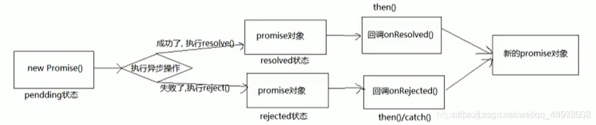

# Promise 的理解和使用

## Promise 是什么

### 理解 Promise

Promise 是 JS 中进行异步编程的新的解决方案（旧方案是单纯使用回调函数）。

promise 对象用来封装一个异步操作（如 Ajax、定时器、fs 文件操作等），并可以获取这个异步任务成功或失败的结果。

具体使用就是，我们 `new Promise` 构造函数，得到一个 promise 实例对象，通过 promise 对象我们可以使用 `then`、`catch` 等方法。

### Promise 的状态

实例对象 promise 中的一个属性 `PromiseState`，表示 Promise 的状态。

- 一个 Promise 刚被 new 出来的时候，状态是 `pending`（未确定的）；
- 异步任务成功，状态从 `pending` 变为 `resolved`/`fullfilled`；
- 异步任务失败，状态从 `pending` 变为 `rejected`。

注意：

- promise 对象的状态不受外界影响；
- Promise 状态只有这三种，且一个 promise 对象的状态只能改变一次；
- 一旦状态改变，就不会再变，任何时候都可以得到这个结果；
- 无论成功还是失败，都会有一个结果数据。成功的结果数据一般称为 `value`，而失败的结果一般称为 `reason`。

### Promise 对象的值

实例对象 promise 的另一个属性 `PromiseResult`，保存着对象成功（`value`）或失败（`reason`）的值。

### Promise 的基本流程



- `new Promise()` 中接收一个回调函数作为参数，在回调函数中执行异步操作；
- `then()` 可以指定成功或者失败的回调函数，`catch()` 只能指定失败的回调函数；
- `then()`、`catch()` 都会返回一个新的 promise 对象。

### Promise 的基本使用

```js
const promise = new Promise(function (resolve, reject) {    // 执行器函数
  // 执行器回调中做异步操作
  if (异步操作成功) {
    resolve(value)
  } else {
    reject(reason)
  }
})
```

Promise 构造函数接受一个执行器函数作为参数，执行器函数的两个参数分别是 `resolve` 和 `reject`。它们是两个函数，由 JavaScript 引擎提供，不用自己部署。

- `resolve` 函数的作用是，将 Promise 对象的状态从“未完成”变为“成功”（即从 `pending` 变为 `resolved`），在异步操作成功时调用，并将成功的结果作为参数 `value` 传递出去；
- `reject` 函数的作用是，将 Promise 对象的状态从“未完成”变为“失败”（即从 `pending` 变为 `rejected`），在异步操作失败时调用，并将失败的原因或错误对象作为参数 `reason`/`error` 传递出去。

Promise 实例生成以后，可以用 `then` 方法分别指定 `resolved` 状态和 `rejected` 状态的回调函数。

```js
promise.then(function (value) {   // onResolved
  // success
}, function (reason) {            // onRejected
  // failure
})
```

`then` 方法可以接受两个回调函数作为参数：
- 第一个回调函数 `onResolved()`，是 Promise 对象的状态变为 `resolved` 时调用；
- 第二个回调函数 `onRejected()`，是 Promise 对象的状态变为 `rejected` 时调用；
- 这两个函数都是可选的，不一定要提供。它们都接受 Promise 对象传出的值作为参数。

```js title="完整代码"
const p = new Promise((resolve, reject) => {    // 执行器函数（同步回调）
  // 执行异步操作任务                                             
  setTimeout(() => {
    const time = Date.now()
    if (time % 2 == 0) {
      // 如果成功，调用 resolve(value)
      resolve('成功的数据，time=' + time)
    } else {
      // 如果失败，调用 reject(reason)
      reject('失败的数据，time=' + time)
    }
  }, 1000)
})

p.then(value => {   // 接收得到成功的 value 数据（onResolved）
  console.log('成功的回调', value)
}, reason => {      // 接收得到失败的 reason 数据（onRejected）
  console.log('失败的回调', reason)
})

// .then() 和执行器（executor）都是同步执行
// .then() 中的回调函数是异步执行
```

## 为什么要用 Promise

## 如何使用 Promise
