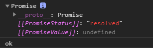
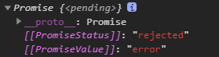

# Promise 的几个关键问题

## 如何改变 promise 的状态？

- `resolve(value)`：如果当前是 `pending` 就会变为 `resolved`；
- `reject(reason)`：如果当前是 `pending` 就会变为 `rejected`；
- 抛出异常（`throw new Error('出错了')`）：如果当前是 `pending` 就会变为 `rejected`。

```js
const p = new Promise((resolve, reject) => {
  // resolve(1)               // promise 变为 resolved 成功状态
  // reject(2)                // promise 变为 rejected 失败状态
  throw new Error('出错了')    // 抛出异常，promise 变为 rejected 失败状态，reason 为抛出的 error
})

p.then(value => {}, reason => {
  console.log(reason)   // Error:出错了
})
```

## 一个 promise 指定多个成功/失败回调函数，都会调用吗？

当 promise 改变为对应状态时，都会调用。

```js
const p = new Promise((resolve, reject) => {
  // resolve(1)
  reject(2)
})

p.then(value => {}, reason => {
  console.log(reason)   // 2
})
p.then(value => {}, reason => {
  console.log(reason)   // 2
})
```

## 改变 promise 状态和指定回调函数谁先谁后？

都有可能，常规是先指定回调再改变状态，但也可以先改变状态再指定回调。

**如何先改变状态再指定回调？**

```js title="在执行器中直接调用 resolve()/reject()"
let p = new Promise((resolve, reject) => {
  // setTimeout(() => {   // 有异步就是先指定回调，否则就是先改变状态
  resolve('OK')
  // }, 1000)
})

p.then(value => {
  console.log(value)
}, reason => {
})
```

```js title="延迟更长时间才调用 then()"
const p = new Promise((resolve, reject) => {
  setTimeout(() => {
    resolve(1)
  }, 1000)
})

setTimeout(() => {
  p.then(value => {
    console.log(value)
  })
}, 2000)
```

**什么时候才能得到数据？**

数据都是在指定的回调中获取的，在调用指定的回调获取数据之前，会先判断 promise 的状态是否改变：
- 如果没有改变，就不调用回调，而是把回调放到微队列中，等 promise 状态改变了，再调用微队列中的回调；
- 如果改变了，就直接异步执行指定的回调。

## promise.then() 返回的新 promise 的结果状态由什么决定？

由 `then()` 指定的回调函数**执行的结果**决定。

- 如果回调函数**返回的**是非 promise 的值，那 `then()` 就返回成功的 promise，`value` 为回调中返回的值；
- 如果回调函数**返回的**是 promise，那 `then()` 就直接返回这个 promise；
- 如果回调函数**抛出异常**，那 `then()` 就返回失败的 promise，`reason` 为回调中抛出的异常。

```js title="返回的不是 promise"
let p = new Promise((resolve, reject) => {
  resolve('ok')
})

let result = p.then(value => {
  console.log(value)    // 没有 return，即返回值为 undefined
}, reason => {
  console.warn(reason)
})

console.log(result)
```



```js title="返回的是 promise"
let p = new Promise((resolve, reject) => {
  resolve('ok')
})

let result = p.then(value => {
  return new Promise((resolve, reject) => {
    // resolve('success')
    reject('error')
  })
}, reason => {
  console.warn(reason)
})

console.log(result)
```



```js title="抛出异常"
let p = new Promise((resolve, reject) => {
  resolve('ok')
})

let result = p.then(value => {
  throw '出了问题'
}, reason => {
  console.warn(reason)
})

console.log(result)
```


```js title="综合示例1"
new Promise((resolve, reject) => {
  resolve(1)
}).then(value => {
  console.log('onResolved1()', value)
}, reason => {
  console.log('onRejected1()', reason)
}).then(value => {
  console.log('onResolved2()', value)
}, reason => {
  console.log('onRejected2()', reason)
})

// onResolved1() 1
// onResolved2() undefined
```

```js title="综合示例2"
new Promise((resolve, reject) => {
  reject(1)
}).then(value => {
  console.log('onResolved1()', value)
}, reason => {
  // 失败的回调函数没有 return，即 return undefined
  // 所以新生成的 promise 的状态是 resolved，值是 undefined
  console.log('onRejected1()', reason)
}).then(value => {
  console.log('onResolved2()', value)
}, reason => {
  console.log('onRejected2()', reason)
})

// onRejected1() 1
// onResolved2() undefined
```

```js title="综合示例3"
new Promise((resolve, reject) => {
  resolve(1)
}).then(value => {
  console.log('onResolved1()', value)
  // return 2                   // onResolved2() 2
  // return Promise.resolve(3)  // onResolved2() 3
  // return Promise.reject(4)   // onRejected2() 4
  // throw 5                    // onRejected2() 5
}, reason => {
  console.log('onRejected1()', reason)
}).then(value => {
  console.log('onResolved2()', value)
}, reason => {
  console.log('onRejected2()', reason)
})

// onResolved1() 1
// onResolved2() undefined
```

## promise 如何串联多个操作任务？

promise 的 `then()` 返回一个新的 promise，可以并成 `then()` 的链式调用，通过 `then` 的链式调用串联多个同步/异步任务。

`then` 的执行依赖于上一个 `then` 的回调的执行结果。

```js
let p = new Promise((resolve, reject) => {
  setTimeout(() => {
    resolve('OK')
  }, 1000)
})

p.then(value => {
  return new Promise((resolve, reject) => {
    resolve('success')
  })
}).then(value => {
  console.log(value)  // success
}).then(value => {
  console.log(value)  // undefined
})
```

```js
new Promise((resolve, reject) => {
  setTimeout(() => {
    console.log('执行任务1(异步)')
    resolve(1)
  }, 1000)
}).then(value => {
  console.log('任务1的结果', value)
  console.log('执行任务2(同步)')
  return 2    // 同步任务可以直接 return 返回结果
}).then(value => {
  console.log('任务2的结果', value)
  // 异步任务需要包裹在 Promise 对象中
  // 否则后面的 then 的回调中将拿不到异步任务的结果
  return new Promise((resolve, reject) => {
    setTimeout(() => {
      console.log('执行任务3(异步)')
      resolve(3)
    }, 1000)
  })
}).then(value => {
  console.log('任务3的结果', value)
})

// 执行任务1(异步)
// 任务1的结果 1
// 执行任务2(同步)
// 任务2的结果 2
// 执行任务3(异步)
// 任务3的结果 3
```

```js
new Promise((resolve, reject) => {
  setTimeout(() => {
    resolve(1)
  }, 1000)
}).then(value => {
  console.log(value)  // 1
  return 2
}).then(value => {
  console.log(value)  // 2
  // 异步任务没有放在 Promise 中，所以这个回调 return 的是 undefined
  setTimeout(() => {
    return 3    // 这里的 return，是定时器的回调的 return，而不是 then 的回调的 return
  }, 1000)
}).then(value => {
  console.log(value)  // undefined
})
```

## Promise 异常穿透（传透）

当使用 promise 的 `then` 链式调用时，可以在最后指定失败的回调，前面任何操作出了异常，都会传到最后失败的回调中处理。

```js
new Promise((resolve, reject) => {
  // resolve(1)
  reject(1)
}).then(value => {
  console.log('onResolved1()', value)
  return 2
}).then(value => {
  console.log('onResolved2()', value)
  return 3
}).then(value => {
  console.log('onResolved3()', value)
}).catch(reason => {
  console.log('onRejected1()', reason)
})

// onRejected1() 1
```

以上代码，相当于下面这种写法：多写了很多 `reason => { throw reason }`。

```js
new Promise((resolve, reject) => {
  // resolve(1)
  reject(1)
}).then(
  value => {
    console.log('onResolved1()', value)
    return 2
  },
  reason => { throw reason } // 抛出失败的结果 reason
).then(
  value => {
    console.log('onResolved2()', value)
    return 3
  },
  reason => { throw reason } // 抛出失败的结果reason
  // reason => reason		这种写法不行，是 return reason，没有抛出异常
).then(
  value => {
    console.log('onResolved3()', value)
  },
  reason => {throw reason} // 抛出失败的结果reason
  // 也可以改成下面这种形式
  // reason => Promise.reject(reason)
).catch(
  reason => {
    console.log('onRejected1()', reason)
  }
)

// onRejected1() 1
```

所以失败的结果是一层一层处理下来的，最后传递到 `catch` 中。

## 中断 promise 链

当使用 promise 的 `then` 链式调用时，如何在中间中断，不再调用后面的回调函数？

办法：在回调函数中返回一个 `pending` 状态的 promise 对象。

```js
new Promise((resolve, reject) => {
  // resolve(1)
  reject(1)
}).then(value => {
  console.log('onResolved1()', value)
  return 2
}).then(value => {
  console.log('onResolved2()', value)
  return 3
}).then(value => {
  console.log('onResolved3()', value)
}).catch(reason => {
  console.log('onRejected1()', reason)
  // 如果希望后面的 then 执行 onRejected 回调，可以在这里抛出一个异常，或返回失败的 promise
  // throw reason
  // return Promise.reject(reason)
}).then(value => {
  console.log('onResolved4()', value)
}, reason => {
  console.log('onRejected2()', reason)
})

// onRejected1() 1
// onResolved4() undefined
```

为了在 `catch` 中就中断执行，可以这样写：

```js
new Promise((resolve, reject) => {
  // resolve(1)
  reject(1)
}).then(value => {
  console.log('onResolved1()', value)
  return 2
}).then(value => {
  console.log('onResolved2()', value)
  return 3
}).then(value => {
  console.log('onResolved3()', value)
}).catch(reason => {
  console.log('onRejected1()', reason)
  return new Promise(() => {})    // 返回一个 pending 状态的 promise
}).then(value => {
  console.log('onResolved4()', value)
}, reason => {
  console.log('onRejected2()', reason)
})

// onRejected1() 1
```

在 `catch` 中返回一个新的 promise，且这个 promise 没有结果，那么就不会调用后面 `then` 中的回调，以此实现中断 promise 链的效果。
