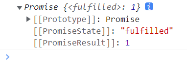

# async 与 await

## async 函数

`async` 函数的返回值为 promise 对象，promise 对象的结果由 `async` 函数执行的返回值决定。

```js
async function fn1() {
  return 1
}

const result = fn1()
console.log(result)
```



```js
async function fn1() {
  // return 1       // 下面代码的输出结果：value: 1
  // throw 2        // 下面代码的输出结果：reason: 2
  // return Promise.reject(3)  // 下面代码的输出结果：reason: 3
  return Promise.resolve(4)    // 下面代码的输出结果：value: 4
}

const result = fn1()
result.then(value => {
  console.log('value:', value)
}, reason => {
  console.log('reason:', reason)
})
```

## await 表达式

`await` 右侧的表达式一般为 promise 对象，但也可以是其它的值。
- 如果表达式是 `promise` 对象，`await` 返回的是 promise 成功的值；
- 如果表达式是其它值，直接将此值作为 `await` 的返回值。

```js title="await 右侧是一个成功的 promise"
function fn1() {
  return new Promise((resolve, reject) => {
    setTimeout(() => {
      resolve(1)
    }, 1000)
  })
}

async function fn2() {
  const result = await fn1()
  console.log(result)
}

fn2()  // 1
```

```js title="await 右侧是一个失败的 promise"
function fn1() {
  return new Promise((resolve, reject) => {
    setTimeout(() => {
      reject(2)
    }, 1000)
  })
}

async function fn2() {
  // 如果没有对错误进行捕获，就会报错
  try {
    const result = await fn1()
    console.log('result:', result)
  } catch (error) {
    console.log('error:', error)  // error: 2
  }
}

// 也可以使用如下方式捕获错误
async function fn2() {
  const result = await fn1().catch(error => error)
  console.log('result:', result)  // result: 2
}

fn2()
```

```js title="await 右侧是其他值"
async function fn() {
  const result = await 3
  console.log('result:', result)  // result: 3
}

fn()
```

## 注意点

- `await` 必须写在 `async` 函数中，但 `async` 函数中可以没有 `await`；
- 如果 `await` 的 promise 失败了，就会抛出异常，需要通过 `try...catch` 捕获处理。

```js
function fn1() { 
  return Promise.resolve(1) 
}

function fn2() { 
  return 2 
}

function fn3() { 
  return Promise.reject(3) 
  // return fn3.test() // 程序运行会抛出异常 
}

function fn4() { 
  return fn3.test() // 程序运行会抛出异常 
}

// 没有使用 await 的 async 函数 
async function fn5() { 
  return 4 
}

async function fn() { 
  // await 右侧是一个成功的 promise
  const result = await fn1() 
  
  // await 右侧是一个非 promise 的数据 
  // const result = await fn2() 
  
  // await 右侧是一个失败的 promise 
  // const result = await fn3() 
  
  // await 右侧抛出异常 
  // const result = await fn4() 
  console.log('result: ', result) 
  
  return result+10 
}

async function test() { 
  try { 
    const result2 = await fn() 
    console.log('result2', result2) 
  } catch (error) { 
    console.log('error', error) 
  }
  const result3 = await fn4() 
  console.log('result4', result3) 
}

test()
```
