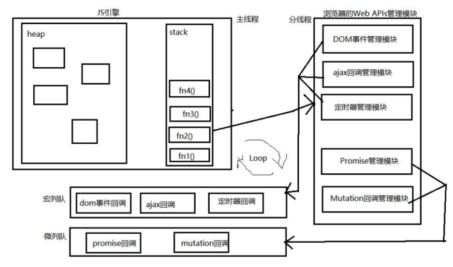

# 宏队列与微队列

宏队列与微队列，也叫宏任务与微任务。

## 原理图



## 队列执行逻辑

JS 中用来存储待执行回调函数的队列包含 2 个：

- 宏队列：用来保存待执行的宏任务（回调），比如：定时器回调、DOM 事件回调、ajax 回调；
- 微队列：用来保存待执行的微任务（回调），比如：promise 的回调、MutationObserver 的回调。

JS 执行时会区别这 2 个队列：

- JS 引擎首先必须先执行完所有的初始化同步任务代码；
- 同步代码执行完毕后，开始准备执行宏任务中的回调；
- 但是每次准备取出第一个宏任务执行前，都要将所有的微任务一个一个取出来执行；
- 微任务可以插队：如果一个微任务产生了另一个微任务，那么也是要等到所有微任务都执行完，才会执行宏任务。

```js title="示例"
setTimeout(() => {  // 放入宏队列
  console.log('timeout callback1')
  Promise.resolve(3).then(value => {  // 放入微队列
    console.log('promise value3:', value)
  })
}, 0)

setTimeout(() => {  // 放入宏队列
  console.log('timeout callback2')
}, 0)

Promise.resolve(1).then(value => {  // 放入微队列
  console.log('promise value1:', value)
})

Promise.reject(2).catch(reason => {  // 放入微队列
  console.log('promise reason2:', reason)
})

// promise value1: 1
// promise reason2: 2
// timeout callback1
// promise value3: 3
// timeout callback2
```

## 面试题

```js title="面试题1"
setTimeout(() => {
  console.log(1)
}, 0)

Promise.resolve().then(() => {
  console.log(2)
})

Promise.resolve().then(() => {
  console.log(4)
})

console.log(3)

// 3 2 4 1
```

```js title="面试题2"
setTimeout(() => {
  console.log(1)
}, 0)

new Promise((resolve) => {
  console.log(2)
  resolve()
}).then(() => {
  console.log(3)
}).then(() => {
  console.log(4)
})

console.log(5)

// 2 5 3 4 1
```

```js title="面试题3"
const first = () => (new Promise((resolve, reject) => {
  console.log(3) 
  let p = new Promise((resolve, reject) => { 
    console.log(7) 
    setTimeout(() => {
      console.log(5) 
      resolve(6) 
    }, 0) 
    resolve(1) 
  })
  resolve(2) 
  p.then((arg) => {
    console.log(arg) 
  }) 
})) 

first().then((arg) => {
  console.log(arg) 
})

console.log(4)

// 3 7 4 1 2 5
```

```js title="面试题4"
setTimeout(() => {
  console.log("0")
}, 0)

new Promise((resolve, reject) => {
  console.log("1")
  resolve()
}).then(() => {
  console.log("2")
  new Promise((resolve, reject) => {
    console.log("3")
    resolve()
  }).then(() => {
    console.log("4")
  }).then(() => {
    console.log("5")
  })
}).then(() => {
  console.log("6")
})

new Promise((resolve, reject) => {
  console.log("7")
  resolve()
}).then(() => {
  console.log("8")
})

// 1 7 2 3 8 4 6 5 0
```
