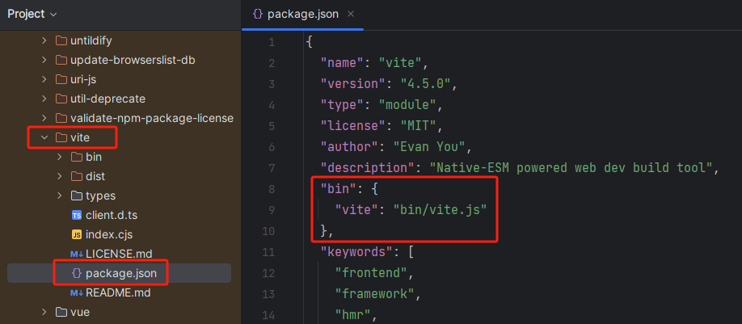

# 项目构建

## 使用 [Vue CLI](https://cli.vuejs.org/zh/)

```shell title="安装"
npm install -g @vue/cli

# OR
yarn global add @vue/cli
```

```shell title="创建项目"
vue create hello-world
```

:::warning
Vue CLI 现已处于维护模式！现在官方推荐使用 [create-vue](https://github.com/vuejs/create-vue) 来创建基于 Vite 的新项目。
:::

## 使用 [Vite](https://cn.vitejs.dev/)

Vite 是新一代前端构建工具，优势如下：

- 轻量快速的热重载（HMR），能实现极速的服务启动；
- 对 TS、JSX、CSS 等支持开箱即用；
- 真正的按需编译，不再等待整个应用编译完成。

```shell title="创建项目"
npm create vue@latest

# OR
npm create vite@latest

# OR
yarn create vite
```

## Webpack 与 Vite 的构建流程对比


## Vite 项目目录介绍

`public` 中是静态资源，不会被编译；`assets` 中也是静态资源，会被编译。

`main.ts` 是入口文件，其中的 `createApp` 函数创建了整个应用实例。

`index.html` 也是入口文件（Webpack、Rollup 的入口文件都是 js 文件，而 Vite 的入口文件是一个 html 文件），Vite 刚开始不会编译这些 js 文件，只有当你用到的时候才会发起请求获取并解析相应的文件，它是利用了浏览器对 script 标签的 `type="module"` 的支持。

  ```html title="index.html"
  <script type="module" src="/src/main.ts"></script>
  ```

`vite.config.ts` 是 Vite 的配置文件，可以配置 Vite 插件、代理等。

`env.d.ts` 是 TS 的文件类型声明文件（不能删），可以让 TS 认识其他类型的文件。

  - 其中 `/// <reference types="vite/client" />` 是将 node_modules 里面的 vite 文件夹里面的 client 客户端类型声明文件导入到这个文件里，默认包含了 css、less、scss 等格式的样式文件，jpg、png、gif、svg、webp 等格式的图片文件，mp3、mp4 等格式的媒体文件，woff、ttf 等格式的字体文件，以及 pdf、txt 等其他格式的文件；
  - 如果引入其他文件报错，那么还需要针对这些文件进行文件类型声明。

## 单文件组件（SFC）

### template

`.vue` 文件中只能有一个 `<template>` 标签。

`<template>` 中的内容会传递给 `@vue/compiler-dom` 预编译为 JS 的渲染函数（`render`）。

### script

`.vue` 文件中可以有多个 `<script>` 块（不包括 `<script setup>`）。

`<script>` 中的内容将作为 ES Module 来执行，模块默认导出的内容应该是 Vue 组件选项对象，它要么是一个普通的对象，要么是 `defineComponent` 的返回值。

### script setup

`.vue` 文件中最多只能有一个 `<script setup>` 块（不包括常规的 `<script>`）。

`<script setup>` 中的内容会被预处理并作为组件的 `setup()` 函数使用，`<script setup>` 中声明的变量会自动暴露给模板，在模板中可以直接使用。

### style

`.vue` 文件可以有多个 `<style>` 标签。

`<style>` 标签可以通过 `scoped` 或 `module` 将样式封装在当前组件内。多个不同封装模式的 `<style>` 标签可以在同一个组件中混用。

## npm run dev 流程

1. 运行 `npm run dev` 时，会先去 package.json 中的 scripts 里面找到 `dev` 命令并执行。

   

   那为什么不直接执行 vite 命令呢？因为在我们的电脑上，并没有配置过 vite 的相关命令，所以无法直接执行。

2. `dev` 对应的是 `vite` 命令，于是就会到 `node_modules/` 目录中找到 `vite` 目录（`npm install` 的时候会把 Vite 也装上），读取 `vite` 目录中的 package.json 文件，发现它做了一个软链接（bin）。

   

3. 通过软链接，就会到 `node_modules/bin/` 目录中找到对应的脚本文件（`npm install` 的时候会在 `node_modules/.bin/` 目录中创建好脚本文件），然后执行脚本找到相应的 js 文件来执行。

   

   查找规则是：
   - 先从当前项目的 `node_modules/bin` 中找；
   - 找不到去全局的 `node_module/bin` 中找；
   - 再找不到就去环境变量中找，如果还找不到就会报错。

   `node_modules/bin` 目录中有三个 vite 文件，为什么会有三个文件呢？

    ```shell
    # unix Linux macOS 系统默认的可执行文件
    vite
  
    # windows cmd 中默认的可执行文件
    vite.cmd
  
    # Windows PowerShell 中可执行文件
    vite.ps1
    ```
