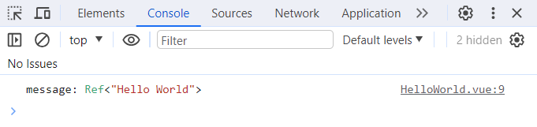

# Vue3 核心语法（一）

## OptionsAPI 与 CompositionAPI

Vue2 的 API 是 Options（配置）风格的，Vue3 的 API 是 Composition（组合）风格的。

Options API 的弊端：数据、方法、计算属性等，都分散在 `data`、`methods`、`computed` 中，若想新增或者修改一个需求，就需要分别修改 `data`、`methods`、`computed`，不便于维护和复用。

Composition API 的优势：可以用函数的方式，更加优雅地组织代码，让相关功能的代码更加有序地组织在一起，可维护性高。


## 拉开序幕的 setup

### setup 概述

`setup` 是 `Vue3` 中一个新的配置项，值是一个函数，它是 `Composition API` **“表演的舞台”**，组件中所用到的数据、方法、计算属性、监视等等，均配置在 `setup` 中。

特点如下：

- `setup` 函数返回的对象中的内容，可直接在模板中使用；
- `setup` 中访问 `this` 是 `undefined`；
- `setup` 函数会在 `beforeCreate` 之前调用，它是“领先”所有钩子执行的。

```html
<template>
  <h2>姓名：{{ name }}</h2>
  <h2>年龄：{{ age }}</h2>
  <button @click="changeName">修改名字</button>
  <button @click="changeAge">年龄+1</button>
  <button @click="showTel">点我查看联系方式</button>
</template>

<script lang="ts">
  export default {
    name: 'Person',
    setup() {
      console.log(this)   // undefined
  
      // 数据，原来写在 data 中（此时的 name、age、tel 都不是响应式数据）
      let name = '张三'
      let age = 18
      let tel = '13888888888'
  
      // 方法，原来写在 methods 中
      function changeName() {
        name = 'zhang-san'  // name 的值会在内存中被修改，但页面不会更新
      }
      function changeAge() {
        age += 1            // age 的值会在内存中被修改，但页面不会更新
      }
      function showTel() {
        alert(tel)
      }
  
      // 返回一个对象，对象中的内容，模板中可以直接使用
      return { name, age, tel, changeName, changeAge, showTel }
    }
  }
</script>
```

### setup 的返回值

- 若返回一个**对象**：则对象中的属性、方法等，在模板中均可以直接使用
- 若返回一个**函数**：则可以自定义渲染内容，如：
    ```ts
    setup() {
      // 返回一个渲染函数
      return () => '你好啊！'
    }
    ```

### setup 与 Options API 的关系

Options API 中**可以访问**到 `setup` 中的属性和方法，但 `setup` 中**不能访问**到 Options API 中的属性和方法。

- 因为在生命周期中 `setup` 是最先执行的，`setup` 执行完成后会把数据挂到应用实例上，而 Options API 中的 `this` 指向的就是应用实例，所以可以访问到；
- 注意，`setup` 比 `data` 的执行还要早，所以 `data` 中可以通过 `this` 访问到 `setup` 中的数据，但 `setup` 中访问不到 `data` 中的数据；
- 如果 Options API 与 `setup` 中的属性或方法有冲突，以 `setup` 为优先。

### setup 语法糖

```html
<template>
  <h2>姓名：{{ name }}</h2>
  <h2>年龄：{{ age }}</h2>
  <button @click="changName">修改名字</button>
  <button @click="changAge">年龄+1</button>
  <button @click="showTel">点我查看联系方式</button>
</template>

<script lang="ts">
  export default {
    name: 'Person',
  }
</script>

<!-- setup 语法糖 -->
<script setup lang="ts">
  console.log(this)   // undefined

  // 数据（此时的 name、age、tel 都不是响应式数据）
  let name = '张三'
  let age = 18
  let tel = '13888888888'

  // 方法
  function changName() {
    name = '李四'   // name 的值会在内存中被修改，但页面不会更新
  }
  function changAge() {
    age += 1        // age 的值会在内存中被修改，但页面不会更新
  }
  function showTel() {
    alert(tel)
  }
</script>
```

### 指定组件名字

以上代码，还需要编写一个不写 `setup` 的 `script` 标签，去指定组件名字，比较麻烦，我们可以借助 `vite` 中的插件简化。

1. 安装插件：`npm i vite-plugin-vue-setup-extend -D`。

```ts title="2. 在 vite.config.ts 中使用插件"
import { defineConfig } from 'vite'
import vue from '@vitejs/plugin-vue'
// highlight-next-line
import VueSetupExtend from 'vite-plugin-vue-setup-extend'

export default defineConfig({
  // highlight-next-line
  plugins: [vue(), VueSetupExtend()]
})
```

3. 定义组件名字：`<script setup lang="ts" name="Person">`。

:::tip
Vue3.3+ 提出了 `defineOptions` 函数，可以用来直接在 `<script setup>` 中声明组件选项，而不必使用单独的 `<script>` 块。

```html
<script setup>
defineOptions({
  name: 'Person'
})
</script>
```
:::

## ref 全家桶

### ref

作用：为**基本类型**的数据添加响应式。

语法：`let xxx = ref(初始值)`。

返回值：一个 `RefImpl` 的实例对象，简称 ref 对象，ref 对象的 **`value` 属性是响应式的**。

注意点：
- `JS` 中操作数据需要 `xxx.value`，但模板中不需要 `.value`，直接使用即可，因为模板中会自动“解包”；
- 对于 `let name = ref('张三')` 来说，`name` 不是响应式的，`name.value` 才是响应式的。

```html
<template>
  <h2>姓名：{{ name }}</h2>
  <h2>年龄：{{ age }}</h2>
  <button @click="changeName">修改名字</button>
  <button @click="changeAge">年龄+1</button>
  <button @click="showTel">点我查看联系方式</button>
</template>

<script setup lang="ts" name="Person">
import { ref } from 'vue'

// name 和 age 是一个 RefImpl 的实例对象，简称 ref 对象，它们的 value 属性是响应式的
let name = ref('张三')
let age = ref(18)
// tel 就是一个普通的字符串，不是响应式的
let tel = '13888888888'

function changeName() {
  // JS 中操作 ref 对象时候需要 .value
  name.value = '李四'

  // 注意：name 不是响应式的，name.value 才是响应式的，所以如下代码并不会引起页面的更新
  // name = ref('zhang-san')
}
function changeAge() {
  // JS 中操作 ref 对象时候需要 .value
  age.value += 1
}
function showTel() {
  alert(tel)
}
</script>
```

### isRef

用于判断一个值是不是一个 `ref` 对象。

```ts
import { ref, Ref, isRef } from 'vue';

let message1: Ref<string | number> = ref('Hello World');
let message2: number = 123;

const changeMsg = () => {
  message1.value = '你好世界';
  console.log(isRef(message1));  // true
  console.log(isRef(message2));  // false
};
```

### ref 控制台小妙招

在控制台查看输出的 `ref` 对象很不方便，可以点击控制台右上角的“设置”，勾选“启用自定义格式设置工具”。


刷新浏览器，现在控制台输出的值就很明了。



### shallowRef

“浅”的 `ref` 响应式对象，只有 `.value` 属性是响应式的，`.value` 中的值不是响应式的。

```html
<script setup lang="ts">
import { Ref, shallowRef } from 'vue'

interface Obj {
  name: string
}

const person: Ref<Obj> = shallowRef({
  name: '张三'
})
const changePerson = () => {
  // 无法对 name 属性进行修改，因为用的是 shallowRef，name 属性没有响应式
  // person.value.name = '李四'
  
  // 但可以对 .value 进行修改，因为 .value 是响应式的
  person.value = { name: '李四' }
}
</script>

<template>
  <div>{{ person }}</div>
  <button @click="changePerson">changePerson</button>
</template>
```

`shallowRef()` 常用于对大型数据结构的性能优化，减少大型不可变结构的响应性开销。

### triggerRef

对于 `shallowRef`，修改 `.value` 中的值不会引起页面更新，因为它不是响应式的。但可以使用 `triggerRef` 进行强制更新。

```html
<script setup lang="ts">
import { Ref, shallowRef, triggerRef } from 'vue'

interface Obj {
  name: string
}

const person: Ref<Obj> = shallowRef({
  name: '张三'
})
const changePerson = () => {
  // name 属性的值在内存中被修改了，但是无法对视图进行更新，因为用的是 shallowRef，name 属性没有响应式
  person.value.name = '李四'
  // 在对 person 进行修改后，使用 triggerRef，可以强制更新 person
  triggerRef(person)
}
</script>

<template>
  <div>{{ person }}</div>
  <button @click="changePerson">changePerson</button>
</template>
```

### 注意事项

同时修改 `shallowRef()` 与 `ref()` 定义的数据，`shallowRef` 的数据也会改变。

```ts
import { ref, shallowRef } from 'vue';

const p1 = ref({ name: '张三' });
const p2 = shallowRef({ name: '李四' });

const handleChange = () => {
  p1.value.name = '张三123';
  // p2 的 name 本来是改不了的，因为它是 shallowRef 定义的
  // 但由于这个方法中也修改了 p1，p1 是 ref 定义的，ref 底层是调用 triggerRef 更新视图的
  // 所以 p2 也被一起修改了
  p2.value.name = '李四123';
};
```

### customRef

用于创建一个自定义的 ref，并对其依赖的数据进行跟踪（track）和更新触发（trigger）进行逻辑控制。

`customRef` 是一个函数，接受 track（跟踪）、trigger（触发）作为参数，返回一个包含 getter、setter 的对象。

```html title="实现防抖效果"
<script setup lang="ts">
import { customRef } from 'vue'

// 自定义 myRef
function myRef<T, K>(value: T, delay: K) {
  let timer
  // 通过 customRef 去实现自定义
  return customRef((track, trigger) => {
    return {
      get() {
        track()   // 告诉 Vue 这个依赖的值（value）是需要被“追踪”的（追踪其变化）
        return value
      },
      set(newValue) {
        clearTimeout(timer)
        timer = setTimeout(() => {
          value = newValue
          trigger()   // 告诉 Vue 去更新界面
        }, delay)
      }
    }
  })
}

let keyword = myRef('hello', 500)
</script>

<template>
  <input v-model="keyword" type="text">
  <h3>{{ keyword }}</h3>
</template>
```

### ref 标识

用在普通 DOM 标签上，获取的是 DOM 节点；用在组件标签上，获取的是组件实例对象。

```html title="用在普通 DOM 标签上"
<template>
  <!-- 使用 ref 给元素打“标识” -->
  <h1 ref="title1">HTML</h1>
  <h2 ref="title2">CSS</h2>
  <h3 ref="title3">JS</h3>
  <input ref="inpt" type="text"> <br><br>
  <button @click="showLog">点我打印内容</button>
</template>

<script setup lang="ts" name="Person">
  import { ref } from 'vue'

  // 变量名必须与模板中的 ref 的值保持一致
  // ref 也可以接受一个泛型，否则会被推断为 any
  let title1 = ref<HTMLElement>()
  let title2 = ref<HTMLElement>()
  let title3 = ref<HTMLElement>()

  function showLog() {
    // 通过 id 获取元素
    // 注意，如果其他组件中也有相同 id 元素，那么可能无法正确获取当前组件的 id 元素
    const t1 = document.getElementById('title1')
    console.log((t1 as HTMLElement).innerText)
    console.log((<HTMLElement>t1).innerText)
    console.log(t1?.innerText)

    // 通过 ref 获取元素
    console.log(title1.value)    // 通过 .value 获取 DOM 元素
    console.log(title2.value)
    console.log(title3.value)
  }
</script>
```

```html title="用在组件标签上"
<!-- 父组件 App.vue -->
<template>
  <Person ref="ren" />
  <button @click="test">测试</button>
</template>

<script setup lang="ts" name="App">
  import { ref } from 'vue'
  import Person from './components/Person.vue'

  let ren = ref()

  function test() {
    console.log(ren.value.name)
    console.log(ren.value.age)
  }
</script>

<!-- 子组件 Person.vue 中要使用 defineExpose 暴露内容 -->
<script setup lang="ts" name="Person">
  import { ref } from 'vue'
  
  let name = ref('张三')
  let age = ref(18)
  
  // 使用 defineExpose 将组件中的数据交给外部
  defineExpose({ name, age })
</script>
```

## reactive 全家桶

### reactive

作用：为**复杂类型**的数据添加响应式（基本类型不要用它，要用 `ref`，否则报错）。

语法：`let xxx = reactive(源对象)`。

返回值：一个 `Proxy` 的实例对象，简称“响应式对象”。

注意点：
- `reactive` 定义的响应式数据是“深层次”的；
- `ref` 可以为任意类型的数据添加响应式，如果是复杂类型的数据，`ref` 底层其实也是调用的 `reactive`。

```html
<template>
  <h2>汽车信息：一台{{ car.brand }}汽车，价值{{ car.price }}万</h2>
  <h2>游戏列表：</h2>
  <ul>
    <li v-for="g in games" :key="g.id">{{ g.name }}</li>
  </ul>
  <h2>测试：{{ obj.a.b.c.d }}</h2>
  <button @click="changeCarPrice">修改汽车价格</button>
  <button @click="changeFirstGame">修改第一游戏</button>
  <button @click="test">测试</button>
</template>

<script setup lang="ts" name="Person">
  import { reactive } from 'vue'
  
  let car = reactive({ brand: '奔驰', price: 100 })
  let games = reactive([
    { id: 'ahsgdyfa01', name: '英雄联盟' },
    { id: 'ahsgdyfa02', name: '王者荣耀' },
    { id: 'ahsgdyfa03', name: '原神' }
  ])
  let obj = reactive({      // reactive 定义的响应式数据是深层次的
    a: {
      b: {
        c: {
          d: 666
        }
      }
    }
  })

  function changeCarPrice() {
    car.price += 10
  }
  function changeFirstGame() {
    games[0].name = '流星蝴蝶剑'
  }
  function test() {
    obj.a.b.c.d = 999
  }
</script>
```

### shallowReactive

```ts
let obj = {
  a: 1,
  first: {
    b: 2,
    second: {
      c: 3
    }
  }
};
let state = shallowReactive(obj);

const change = () => {
  // 第一层的数据可以修改，会更新视图
  state.a = 2;
  // 第二层的数据只会在内存中修改，不会更新视图
  state.first.b = 3;
};
```

通过使用 [`shallowRef()`](https://cn.vuejs.org/api/reactivity-advanced.html#shallowref) 和 [`shallowReactive()`](https://cn.vuejs.org/api/reactivity-advanced.html#shallowreactive) 来绕开深度响应。浅层式 API 创建的状态只在其顶层是响应式的，对所有深层的对象不会做任何处理，避免了对每一个内部属性做响应式所带来的性能成本，这使得属性的访问变得更快，可提升性能。

### 数组异步赋值问题

以下代码，对响应式的对象直接赋值，这样会导致该数据失去响应式。虽然数据在内存中会被修改，但视图不会更新。

```ts
import { reactive } from 'vue';

let arr = reactive([1, 2, 3]);
setTimeout(() => {
  // highlight-start
  arr = [4, 5, 6];
  // arr = reactive([4, 5, 6]);   // 即使是赋值为一个新的 reactive 响应式对象，页面也不会更新
  // highlight-end
  console.log('arr:', arr);   // [4, 5, 6]
}, 1000);
```

```ts title="解决方案1：使用数组的方法"
import { reactive } from 'vue';

let arr = reactive([1, 2, 3]);
setTimeout(() => {
  // highlight-next-line
  arr.push(...[4, 5, 6]);
}, 1000);
```

```ts title="解决方案2：包装在一个对象中"
import { reactive } from 'vue';

let data = reactive({
  arr: [1, 2, 3]
});
setTimeout(() => {
  // highlight-next-line
  data.arr = [4, 5, 6];
}, 1000);
```

```ts title="解决方案3：Object.assign()"
import { reactive } from 'vue';

let arr = reactive([1, 2, 3]);
setTimeout(() => {
  // highlight-start
  Object.assign(arr, [4, 5, 6])
  // highlight-end
}, 1000);
```

## ref 对比 reactive

宏观角度看：
- `ref` 可以用来定义**基本类型数据**、**对象类型数据**
- `reactive` 只能用来定义**对象类型数据**
- 若 `ref` 接收的是对象类型，底层其实也是调用了 `reactive` 实现响应式

区别：
- `ref` 创建的变量必须使用 `.value`（可以使用 `volar` 插件自动添加 `.value`）
- `reactive` 如果重新分配一个新对象，会**失去**响应式（可以使用 `Object.assign` 去整体替换）

使用原则：
- 若需要一个基本类型的响应式数据，必须使用 `ref`
- 若需要一个响应式对象，层级不深，`ref`、`reactive` 都可以
- 若需要一个响应式对象，且层级较深，推荐使用 `reactive`

```html
<script setup lang="ts">
import { ref } from 'vue'

let car = ref({ brand: '奔驰', price: 100 })
let games = ref([
  { id: 'ahsgdyfa01', name: '英雄联盟' },
  { id: 'ahsgdyfa02', name: '王者荣耀' },
  { id: 'ahsgdyfa03', name: '原神' }
])
// 即使是用 ref 定义深层次的对象，对象的响应式也是深层次的
// 因为 ref 底层也是调用 reactive 实现响应式
let obj = ref({
  a: {
    b: {
      c: {
        d: 666
      }
    }
  }
})

// 用 ref 定义的复杂类型的数据，在 JS 中要 .value
function changeCarPrice() {
  car.value.price += 10
}
function changeFirstGame() {
  games.value[0].name = '流星蝴蝶剑'
}
</script>

<template>
  <!-- 用 ref 定义的复杂类型的数据，在模板中不用 .value -->
  <h2>汽车信息：一台{{ car.brand }}汽车，价值{{ car.price }}万</h2>
  <h2>游戏列表：</h2>
  <ul>
    <li v-for="g in games" :key="g.id">{{ g.name }}</li>
  </ul>
  <button @click="changeCarPrice">修改汽车价格</button>
  <button @click="changeFirstGame">修改第一游戏</button>
</template>
```

```html
<!-- 以下对 ref 和 reactive 定义的数据修改的方式，都是不生效的！ -->
<script setup>
  import { ref, reactive } from 'vue'
  
  let sum = ref(0)
  let car = reactive({ brand: '奔驰', price: 100 })
  
  function changeSum() {
    // 修改 ref 定义的数据，要通过 .value
    sum = ref(9)
  }
  function changeCar() {
    // 修改 reactive 定义的数据，可以使用 Object.assign()
    // 或者修改其中的属性，如 car.brand、car.price
    car = reactive({ brand: '奥迪', price: 200 })
  }
</script>
```

## to 全家桶

### toRefs 与 toRef

作用：将一个响应式对象中的每一个属性，转换为 `ref` 对象。

备注：`toRefs` 与 `toRef` 功能一致，但 `toRefs` 可以批量转换。

```ts
import { reactive, toRefs, toRef } from 'vue'

let person = reactive({ name: '张三', age: 18, gender: '男' })

// 通过解构赋值的方式获取到的 name 和 age，是不具有响应式的
// 这相当于：let name = person.name; let age = person.age
// 所以 name 和 age 相当于是声明的一个新的变量，因此不具有响应式，修改 name 和 age 也无法触发页面更新
// let { name, age } = person

// 通过 toRefs 将 person 对象中的 n 个属性批量取出，且依然保持响应式的能力
let { name, gender } = toRefs(person)

// 通过 toRef 将 person 对象中的 age 属性取出，且依然保持响应式的能力
let age = toRef(person, 'age')

function changeName() {
  // 修改 name.value，也会修改 person.name 的值
  name.value += '~'
}
function changeAge() {
  // 修改 age.value，也会修改 person.age 的值
  age.value += 1
}
function changeGender() {
  // 修改 gender.value，也会修改 person.gender 的值
  gender.value = '女'
}
```

### toRef 注意事项

```ts
import { reactive, toRef } from 'vue';

// 如果原始对象不是响应式的，可以修改数据，但不会更新视图
// const obj = { a: 1, b: 2 };

// 如果原始对象是响应式的，可以修改数据，并且会更新视图
const obj = reactive({ a: 1, b: 2 });

const a = toRef(obj, 'a');

const handleAdd = () => {
  a.value += 1;
};
```

为什么原始对象不是响应式的，使用 `toRef` 转化成 ref 对象后，仍然无法更新视图？

```ts title="toRef 源码"
export function toRef<T extends object, K extends keyof T>(
  object: T,
  key: K,
  defaultValue?: T[K]
): ToRef<T[K]> {
  const val = object[key];
  // 1. 如果原始对象是 ref 对象就直接返回，否则调用 ObjectRefImpl 创建一个类 ref 对象并返回
  return isRef(val) ? val : (new ObjectRefImpl(object, key, defaultValue) as any);
}

class ObjectRefImpl<T extends object, K extends keyof T> {
  public readonly __v_isRef = true;

  constructor(
    private readonly _object: T,
    private readonly _key: K,
    private readonly _defaultValue?: T[K]
  ) {}

  // 2. 类 ref 对象只是做了值的改变，并未处理“收集依赖”和“触发依赖”的过程
  //    所以普通对象无法更新视图
  get value() {
    const val = this._object[this._key];
    return val === undefined ? (this._defaultValue as T[K]) : val;
  }

  set value(newVal) {
    this._object[this._key] = newVal;
  }
}
```

### toRaw 与 markRaw

- `toRaw` 用于将响应式对象转化为普通对象
  - 何时使用：在需要将响应式对象传递给 Vue 以外的库或外部系统时，使用 `toRaw` 可以确保它们收到的是普通对象
- `markRaw` 用于标记一个对象，使其**永远不会**变成响应式的
  - 例如使用 `mockjs` 时，为了防止误把 `mockjs` 变为响应式对象，可以使用 `markRaw` 去标记 `mockjs`

```js
import { reactive, toRaw, markRaw, isReactive } from 'vue'

// 响应式对象
let person = reactive({ name: 'tony', age: 18 })
// 原始对象，不具有响应式
let rawPerson = toRaw(person)

let citys = markRaw([
  { id: 'asdda01', name: '北京' }, { id: 'asdda02', name: '上海' },
  { id: 'asdda03', name: '天津' }, { id: 'asdda04', name: '重庆' }
])
// 根据原始对象 citys 去创建响应式对象 citys2 —— 创建失败，因为 citys 被 markRaw 标记了
let citys2 = reactive(citys)

console.log(isReactive(person))
console.log(isReactive(rawPerson))
console.log(isReactive(citys))
console.log(isReactive(citys2))
```

## readonly 与 shallowReadonly

作用：对特定数据进行保护。

- `readonly` 用于创建一个对象的深只读副本
- `shallowReadonly` 与 `readonly` 类似，但只将对象的顶层属性设置为只读，对象内部的嵌套属性仍然是可变的
- `readonly` 与 `shallowReadonly` 可以对 `ref` 和 `reactive` 定义的数据进行包裹

```ts
import { reactive, readonly } from 'vue';

const lisi = reactive({ name: '李四' });
const lisiCopy = readonly(lisi);

const changeLisi = () => {
  lisi.name = '李四123';
  // lisiCopy 本无法修改，因为它是只读的
  // 但这个方法中也修改了 lisi，lisi 是响应式的，导致 lisiCopy 的修改也会体现在视图上
  lisiCopy.name = '李四123';
}
```
