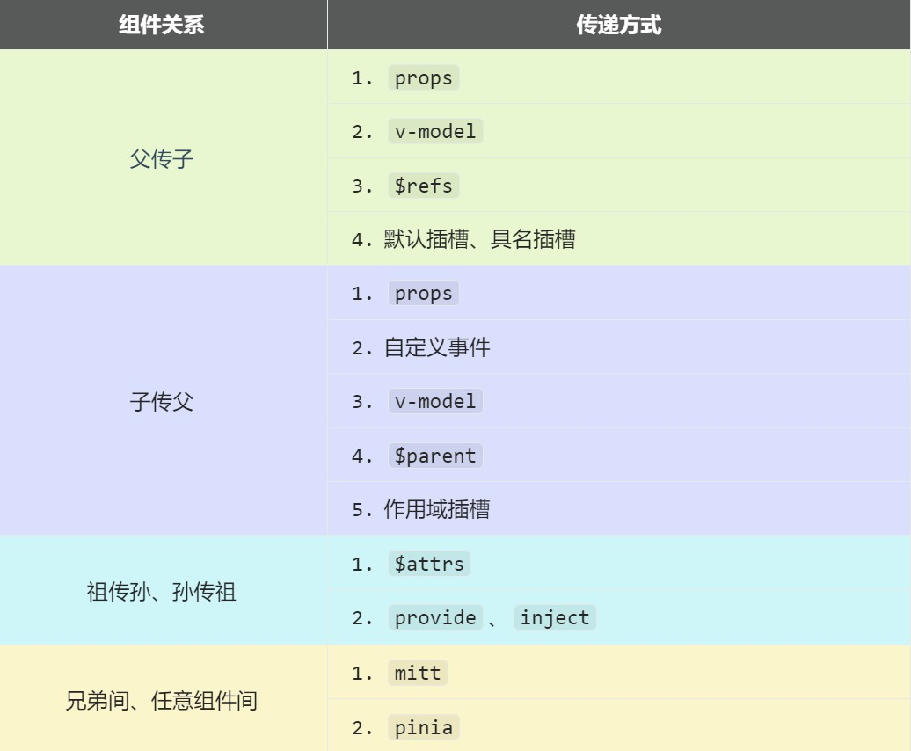

# 组件通信

Vue3 组件通信和 Vue2 的区别：

- 移除事件总线，使用 `mitt` 代替
- Vuex 换成了 Pinia
- 把 `.sync` 优化到了 `v-model` 里面
- 把 `$listeners` 所有的东西，合并到 `$attrs` 中
- `$children` 被移除

常见搭配形式：



## props

`props` 是使用频率最高的一种通信方式，常用于父子组件通信。

- 若 **父传子**：属性值是**非函数**；
- 若 **子传父**：属性值是**函数**。

```html title="父组件"
<template>
   <h4>我的车：{{ car }}</h4>
   <h4>儿子给的玩具：{{ toy }}</h4>
   <Child :car="car" :getToy="getToy" />
</template>

<script setup lang="ts" name="Father">
   import { ref } from "vue";
   import Child from './Child.vue'
   
   const car = ref('奔驰')
   const toy = ref()

   function getToy(value: string) {
      toy.value = value
   }
</script>
```

```html title="子组件"
<template>
   <h4>我的玩具：{{ toy }}</h4>
   <h4>父给我的车：{{ car }}</h4>
   <button @click="getToy(toy)">玩具给父亲</button>
</template>

<script setup lang="ts" name="Child">
   import { ref } from "vue";

   defineProps(['car', 'getToy'])
   
   const toy = ref('奥特曼')
</script>
```

## 自定义事件

自定义事件常用于子组件向父组件传递数据。

注意区分原生事件与自定义事件：
- 原生事件的事件对象 `$event`：是包含事件相关信息的对象（`pageX`、`pageY`、`target`、`keyCode` 等）；
- 自定义事件的事件对象 `$event`：是调用 `emit` 时所提供的数据，可以是任意类型。

```html title="父组件"
<!-- 在父组件中，给子组件绑定自定义事件 -->
<Child @send-toy="toy = $event"/>

<!-- 注意区分原生事件与自定义事件中的 $event -->
<button @click="toy = $event">测试</button>
```

```ts title="子组件"
// 定义事件
const emit = defineEmits<{
  (e: 'send-toy', value: string): void
}>();

// 触发事件
emit('send-toy', '奥特曼');
```

:::tip
Vue 文档推荐自定义事件名始终使用短横线命名方式，而不是使用小驼峰或大驼峰的命名方式。
:::

## mitt

在 Vue3 中，`$on`、`$off`、`$once` 实例方法已被移除，组件实例不再实现事件触发接口，因此大家熟悉的 EventBus 便无法使用了，我们可以使用 `mitt` 库来替代。

`mitt` 与消息订阅与发布（`pubsub`）功能类似，可以实现任意组件间通信。

```shell title="安装"
npm i mitt
```

```ts title="src\utils\emitter.ts"
// 引入 mitt
import mitt from 'mitt';

// 创建 emitter
const emitter = mitt();

// 示例：绑定事件
emitter.on('abc', (value) => {
   console.log('abc事件被触发', value);
});
emitter.on('xyz', (value) => {
   console.log('xyz事件被触发', value);
});

// 示例：触发事件
setInterval(() => {
   emitter.emit('abc', 666);
   emitter.emit('xyz', 777);
}, 1000);

// 示例：清除所有事件
setTimeout(() => {
   emitter.all.clear();
}, 3000);

// 向外暴露 mitt
export default emitter;
```

```ts title="接收数据的组件"
import { onUnmounted } from "vue";
import emitter from "@/utils/emitter";

// 绑定事件
emitter.on('send-toy', (value) => {
  console.log('send-toy事件被触发', value)
})

onUnmounted(() => {
  // 解绑事件
  emitter.off('send-toy')
})
```

```ts title="提供数据的组件"
import emitter from "@/utils/emitter";

function sendToy() {
   // 触发事件
   emitter.emit('send-toy', toy.value)
}
```

其他用法：[小满Vue3（Mitt）](https://xiaoman.blog.csdn.net/article/details/125453908)

## v-model

概述：实现 **父↔子** 之间相互通信。

HTML 标签上的 `v-model` 的本质：`:value` ＋ `input` 事件。

```html title="HTML 标签上使用 v-model"
<input type="text" v-model="userName">

<!-- v-model 的本质是下面这行代码 -->
<input type="text" :value="userName" @input="userName = (<HTMLInputElement>$event.target).value">
```

组件标签上的 `v-model` 的本质：`:moldeValue` ＋ `update:modelValue` 事件。

```html title="组件标签上使用 v-model"
<AtguiguInput v-model="userName" />

<!-- 组件标签上 v-model 的本质 -->
<AtguiguInput :modelValue="userName" @update:model-value="userName = $event" />
```

```html title="AtguiguInput 组件"
<template>
  <input type="text" :value="modelValue" @input="emit('update:model-value', $event.target.value)">
</template>

<script setup lang="ts" name="AtguiguInput">
  // 接收 props
  defineProps(['modelValue'])
  // 声明事件
  const emit = defineEmits(['update:model-value'])
</script>
```

也可以更换 `value`，例如改成 `abc`：

```html
<!-- 也可以更换 value，例如改成 abc -->
<AtguiguInput v-model:abc="userName" />

<!-- 上面代码的本质如下 -->
<AtguiguInput :abc="userName" @update:abc="userName = $event"/>
```

```html title="AtguiguInput 组件"
<template>
   <input type="text" :value="abc" @input="emit('update:abc', $event.target.value)">
</template>

<script setup lang="ts" name="AtguiguInput">
   // 接收 props
   defineProps(['abc'])
   // 声明事件
   const emit = defineEmits(['update:abc'])
</script>
```

如果 `value` 可以更换，那么就可以在组件标签上多次使用 `v-model`。

```html
<AtguiguInput v-model:abc="userName" v-model:xyz="password" />
```

## $attrs

`$attrs` 用于实现**当前组件的父组件**，向**当前组件的子组件**通信（**祖→孙**）。如果祖组件传递一个函数给孙组件，孙组件调用该函数，也可实现**孙→祖**。

使用场景：组件的二次封装，二次封装的组件需要支持原组件的所有属性。

具体说明：`$attrs` 是一个对象，包含所有父组件传入的标签属性。
- 注意：`$attrs` 会自动排除 `props` 中声明的属性（可以认为声明过的 `props` 被子组件自己“消费”了）。

```html title="父组件"
<template>
   <h3>父组件</h3>
   <Child :a="a" :b="b" :c="c" :d="d" v-bind="{x: 100, y: 200}" :updateA="updateA" />
</template>

<script setup lang="ts" name="Father">
   import { ref } from "vue";
   import Child from './Child.vue'

   let a = ref(1)
   let b = ref(2)
   let c = ref(3)
   let d = ref(4)

   function updateA(value) {
      a.value = value
   }
</script>
```

```html title="子组件"
<template>
   <h3>子组件</h3>
   <GrandChild v-bind="$attrs" />
</template>

<script setup lang="ts" name="Child">
   import GrandChild from './GrandChild.vue'
</script>
```

```html title="孙组件"
<template>
   <h3>孙组件</h3>
   <h4>a：{{ a }}</h4>
   <h4>b：{{ b }}</h4>
   <h4>c：{{ c }}</h4>
   <h4>d：{{ d }}</h4>
   <h4>x：{{ x }}</h4>
   <h4>y：{{ y }}</h4>
   <button @click="updateA(666)">点我更新A</button>
</template>

<script setup lang="ts" name="GrandChild">
   defineProps(['a', 'b', 'c', 'd', 'x', 'y', 'updateA'])
</script>
```

## $refs、$parent

概述：
- `$refs` 用于**父→子**
- `$parent` 用于**子→父**

原理如下：

| 属性        | 说明                                   |
|-----------|--------------------------------------|
| `$refs`   | 值为对象，包含所有被 `ref` 属性标识的 `DOM` 元素或组件实例 |
| `$parent` | 值为对象，当前组件的父组件实例对象                    |

```html
<template>
    <Child1 ref="child1Ref" />
    <Child2 ref="child2Ref" />
    <button @click="getChildren($refs)">getChildren</button>
    <button @click="getParent($parent)">getParent</button>
</template>

<script setup lang="ts">
    import { ref } from 'vue'
    
    const child1Ref = ref()
    const child2Ref = ref()
    
    function getChildren(refs) {
        console.log(refs)
    }
    function getParent(parent) {
        console.log(parent)
    }
</script>
```

注意，通过 `$refs` 访问子组件实例或通过 `$parent` 访问父组件实例时，如果要操作子组件或父组件中的数据或方法，需要子组件或父组件使用 `defineExpose()` 暴露出来。

## provide、inject

概述：实现**祖孙组件**直接通信。

具体使用：
- 在祖先组件中通过 `provide` 向后代组件提供数据或方法
- 在后代组件中通过 `inject` 来声明接收数据或方法

```html title="父组件中，使用 provide 提供数据"
<template>
   <h4>资产：{{ money }}</h4>
   <h4>汽车：{{ car }}</h4>
   <button @click="money += 1">资产+1</button>
   <button @click="car.price += 1">汽车价格+1</button>
   <Child />
</template>

<script setup lang="ts" name="Father">
   import { ref, reactive, provide } from "vue";
   import Child from './Child.vue'
   
   let money = ref(100)
   let car = reactive({
      brand: '奔驰',
      price: 100
   })

   function updateMoney(value: number) {
      money.value += value
   }

   // 如果传递 money.value，那就是传递的具体的值，会导致 money 失去响应式
   // 当 money 更新时，后代组件使用到 money 的地方都不会随之更新
   // provide('moneyContext', { money: money.value, updateMoney })
   
   // 所以要传递 money，这样传递的才是 ref 对象，才具有响应式
   provide('moneyContext', { money, updateMoney })
   provide('car', car)
</script>
```

```html title="后代组件中使用 inject 接收数据"
<template>
   <h4>资产：{{ money }}</h4>
   <h4>汽车：{{ car }}</h4>
   <button @click="updateMoney(6)">点我</button>
</template>

<script setup lang="ts" name="GrandChild">
   import { inject } from 'vue';
   // inject 的第二个参数是默认值（如果 TS 检查报错，可以通过指定默认值的方式告诉 TS 如何推断）
   let { money, updateMoney } = inject('moneyContext', {
      money: 0,
      updateMoney: (x: number) => {}
   })
   let car = inject('car')
</script>
```

## Pinia

参考之前 Pinia 笔记。

## 插槽

[Vue 插槽详解](https://dongdong12138.github.io/blog/vue-slot)
