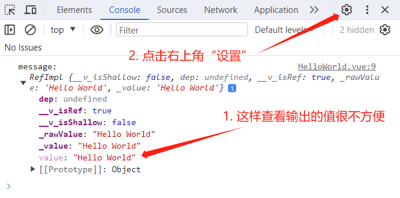

# ref 全家桶

## ref

`ref()` 接受一个内部值，返回一个响应式的 ref 对象，通过 `.value` 属性可以访问该对象的内部值。

```html
<script setup lang="ts">
  // 不使用 ref，直接声明一个变量，该变量的值就无法被修改，因为它不是响应式的
  let message1: string = 'Hello World'

  // 使用 ref，这个变量就是响应式的，它的值可以被修改
  let message2: string = ref('Hello World')

  const changeMsg = () => {
    // message1 不是响应式的，它的修改不会引起模板的重新解析
    message1 = '你好世界'
    // 被 ref 包装之后，要通过 .value 属性来访问内部值
    message2.value = '你好世界'
  }
</script>

<template>
  <!-- 模板中不用 .value，因为模板中会自动“解包” -->
  <div>{{ message1 }}, {{ message2 }}</div>
  <button @click="changeMsg">change</button>
</template>
```

## isRef

用于判断一个值是不是一个 ref 对象。

```ts
import { ref, Ref, isRef } from 'vue';

let message1: Ref<string | number> = ref('Hello World');
let message2: number = 123;

const changeMsg = () => {
  message1.value = '你好世界';
  console.log(isRef(message1));  // true
  console.log(isRef(message2));  // false
};
```

## ref 控制台小妙招

在控制台查看输出的 ref 对象很不方便，可以点击控制台右上角的“设置”，勾选“启用自定义格式设置工具”。




刷新浏览器，现在控制台输出的值就很明了。


## shallowRef

“浅”的 ref 响应式对象，只有 `.value` 属性是响应式的，`.value` 中的值不是响应式的。

```html
<script setup lang="ts">
import { Ref, shallowRef } from 'vue'

interface Obj {
  name: string
}

const person: Ref<Obj> = shallowRef({
  name: '张三'
})
const changePerson = () => {
  // 无法对 name 属性进行修改，因为用的是 shallowRef，name 属性没有响应式
  // person.value.name = '李四'
  
  // 但可以对 .value 进行修改，因为 .value 是响应式的
  person.value = {name: '李四'}
}
</script>

<template>
  <div>{{ person }}</div>
  <button @click="changePerson">changePerson</button>
</template>
```

`shallowRef()` 常用于对大型数据结构的性能优化，减少大型不可变结构的响应性开销。

## triggerRef

对于 shallowRef，修改 `.value` 中的值不会引起页面更新，因为它不是响应式的。但可以使用 triggerRef 进行强制更新。

```html
<script setup lang="ts">
import { Ref, shallowRef, triggerRef } from 'vue'

interface Obj {
  name: string
}

const person: Ref<Obj> = shallowRef({
  name: '张三'
})
const changePerson = () => {
  // name 属性的值在内存中被修改了，但是无法对视图进行更新，因为用的是 shallowRef，name 属性没有响应式
  person.value.name = '李四'
  // 在对 person 进行修改后，使用 triggerRef，可以强制更新 person
  triggerRef(person)
}
</script>

<template>
  <div>{{ person }}</div>
  <button @click="changePerson">changePerson</button>
</template>
```

## 注意事项

同时修改 `shallowRef()` 与 `ref()` 定义的数据，shallowRef 的数据也会改变。

```ts
import { ref, shallowRef } from 'vue';

const p1 = ref({ name: '张三' });
const p2 = shallowRef({ name: '李四' });

const handleChange = () => {
  p1.value.name = '张三123';
  // p2 的 name 本来是改不了的，因为它是 shallowRef 定义的
  // 但由于这个方法中也修改了 p1，p1 是 ref 定义的，ref 底层是调用 triggerRef 更新视图的
  // 所以 p2 也被一起修改了
  p2.value.name = '李四123';
};
```

## customRef

用于创建一个自定义的 ref，并对其依赖项跟踪和更新触发进行显式控制。

`customRef` 是一个函数，接受 track（跟踪）、trigger（触发）作为参数，返回一个包含 getter、setter 的对象。

```html title="实现防抖效果"
<script setup lang="ts">
import { customRef } from 'vue'

// 自定义 myRef
function myRef<T, K>(value: T, delay: K) {
  let timer
  // 通过 customRef 去实现自定义
  return customRef((track, trigger) => {
    return {
      get() {
        track()   // 告诉 Vue 这个 value 值是需要被“追踪”的
        return value
      },
      set(newValue) {
        clearTimeout(timer)
        timer = setTimeout(() => {
          value = newValue
          trigger()   // 告诉 Vue 去更新界面
        }, delay)
      }
    }
  })
}

let keyword = myRef('hello', 500)
</script>

<template>
  <input v-model="keyword" type="text">
  <h3>{{ keyword }}</h3>
</template>
```

## ref 标识

```html
<script setup lang="ts">
import { ref } from 'vue';

// 变量名必须与模板中的 ref 的值保持一致
// ref 也可以接受一个泛型，否则会被推断为 any
const divEle = ref<HTMLDivElement>();

const handleChange = () => {
  // 也要通过 .value 获取 DOM 元素
  console.log(divEle.value.innerText);
};
</script>

<template>
  <!-- 使用 ref 给元素打“标识” -->
  <div ref="divEle">123</div>
  <button @click="handleChange">change</button>
</template>
```
