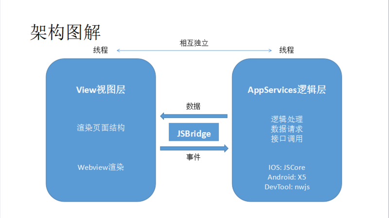
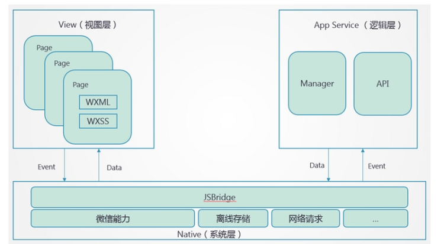
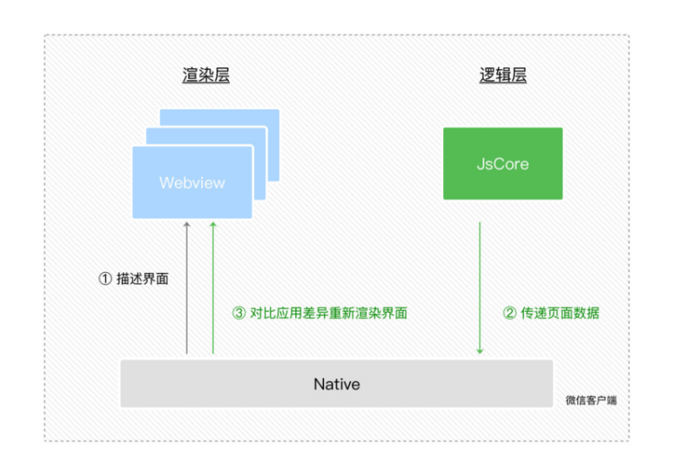
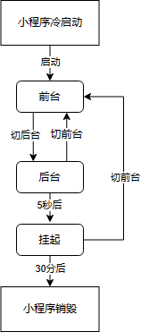
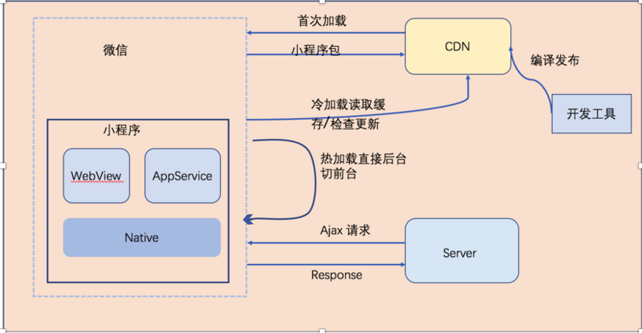
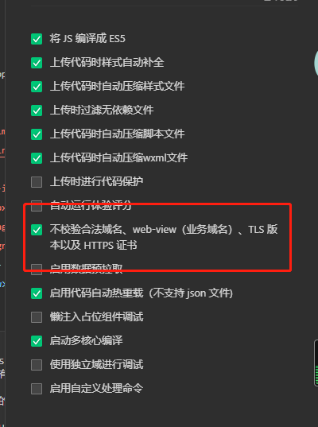

# 小程序机制

## 什么是小程序

小程序页面本质上还是网页，开发用的还是 HTML、CSS、JS，但小程序不支持浏览器 API，只能用宿主环境（如微信、支付宝、淘宝等）提供的 API。
 
## 微信小程序框架介绍

### 双线程模型

客户端原生技术与 Web 技术相结合的混合技术，简称 Hybrid。

在 Web 中，UI 渲染和脚本执行都在一个单线程中执行，这就容易导致一些逻辑任务抢占 UI 渲染的资源；而小程序采用客户端与 Web 两者结合起来的 Hybrid 技术来渲染小程序。

小程序的渲染层与逻辑层分别由两个线程管理（双线程模型）：
- 逻辑层：创建一个单独的线程（JsCore 线程）去执行 JS 脚本，在这里执行的都是有关小程序业务逻辑的代码，负责逻辑处理、数据请求、接口调用等
- 视图层：页面渲染相关的任务全都在 WebView 线程里执行，通过逻辑层的代码去控制渲染哪些页面（一个小程序存在多个界面，所以视图层存在多个 WebView 线程）



JSBridge 起到架起上层开发与 Native（系统层）的桥梁的作用，使得小程序可通过 API 使用原生的功能，且部分组件为原生组件实现，从而有良好体验与性能。



设计目的：为了管控和安全等问题，阻止开发者使用一些例如浏览器的 window 对象跳转页面、操作 DOM、执行一些开放性接口等。

### 数据驱动视图变化

问题：JS 逻辑代码放到单独的线程去运行，在 Webview 线程里没法直接操作 DOM，开发者如何实现动态更改界面呢？

DOM 的更新通过逻辑层与渲染层的数据通信来实现：

1. 在渲染层把 WXML 转化成对应的 JS 对象
2. 在逻辑层发生数据变更的时候，通过宿主环境提供的 `setData` 方法把数据从逻辑层传递到 Native（微信客户端），再由 Native 转发到渲染层
   - 逻辑层和视图层的通信由 Native 做中转，逻辑层发送网络请求也是由 Native 做转发
3. 对比数据的前后差异，把差异应用在原来的 DOM 树上，更新界面
   - JS 对象模拟 DOM 树 -> 比较两棵虚拟 DOM 树的差异 -> 把差异应用到真实 DOM 树上



### 事件的处理

由于视图层只进行渲染，当视图层发生交互，交互事件会被 Native 拦截，由 Native 做中转，将事件的回调传递给逻辑层。


### 运行机制和更新机制



**运行机制（启动机制）**
- 冷启动：用户首次打开小程序或小程序被微信主动销毁后再次打开时，小程序需要重新加载启动
- 热启动：如果用户已经打开过小程序，并在一定时间内再次打开该小程序，则无需重新启动，只需将小程序从后台切换到前台

**更新机制**
- 启动时同步更新：
   - 定期检查小程序版本：微信会定期检查最近使用的小程序是否有更新，如果有更新，下次小程序启动时会同步进行更新，更新到最新版本后再打开小程序
   - 长时间未使用小程序：用户长时间未使用小程序时，会强制同步检查版本更新，更新到最新版本后再打开小程序
- 启动时异步更新：打开小程序发现有新版本，先异步下载，下次冷启动时加载新版本
- 开发者手动调用 `wx.getlpdateManager` API 进行更新
- 小程序管理后台可以设置“优先使用本地版本”和“小程序最低可用版本”

**注意**
- 当小程序进入后台，客户端会维持一段时间的运行，超过一定时间后（目前是 5 分钟）会被微信主动销毁
- 当短时间内（5s）连续两次以上收到系统内存告警，也会进行小程序的销毁



## 微信小程序基本内容

### 基础核心

**代码注入**

- 按需注入：`"lazyCodeLoading": "requiredComponents"`，小程序仅注入当前页面需要的自定义组件和页面代码，在页面中不会用到的自定义组件不会被加载和初始化
- 用时注入：在开启“按需注入”的前提下，指定一部分自定义组件不在小程序启动时注入，而是在真正渲染的时候才进行注入，使用占位组件在需要渲染但注入完成前展示

**分包加载**

原则：
- 声明 `subpackages` 后，将按照 `subpackages` 配置的路径进行打包，`subpackages` 配置路径以外的目录将被打包到 app（主包）中
- app（主包）也可以有自己的 pages（即最外层的 pages 字段）
- `subpackage` 的根目录不能是另外一个 `subpackage` 内的子目录
- tabBar 页面必须在 app（主包）内

独立分包：
- 开发者可以按需将一些页面配置到独立分包中，当小程序从普通的分包页面启动时，需要首先下载主包
- 独立分包运行时，App 并不一定会被注册，因此 `getApp()` 也不一定可以获得 App 对象，基础库 2.2.4 版本开始 `getApp` 支持 `allowDefault` 参数，在 App 未定义时返回一个默认实现。当主包加载，App 被注册时，默认实现中定义的属性会被覆盖合并到真正的 App 中

**小程序如何调试**

- vconsole
- sourceMap
- 实时日志：重写 log，使用 `wx.getRealtimeLogManager` 封装，在运营后台“【开发】->【开发管理】->【运维中心】->【实时日志】”查看
- errno：针对 API 的 callback err 进行状态码的判断，便于针对业务场景语义化展示

**小程序如何兼容版本**

- 版本号比较

   ```js
   const version = wx.getSystemInfoSync().SDKVersion
   
   if (compareVersion(version, '1.1.0') >= 0) {
      wx.openBluetoothAdapter()
   } else {
   // 如果希望用户在最新版本的客户端上体验您的小程序，可以这样子提示
      wx.showModal({
         title: '提示',
         content: '当前微信版本过低，无法使用该功能，请升级到最新微信版本后重试。'
      })
   }
   ```

- 检查 API 是否存在

   ```js
   if (wx.openBluetoothAdapter) {
      wx.openBluetoothAdapter()
   } else {
   // 如果希望用户在最新版本的客户端上体验您的小程序，可以这样子提示
      wx.showModal({
         title: '提示',
         content: '当前微信版本过低，无法使用该功能，请升级到最新微信版本后重试。'
      })
   }
   ```

- 使用 `wx.canIUse`

   ```js
   wx.showModal({
      success: function (res) {
         if (wx.canIUse('showModal.success.cancel')) {
            console.log(res.cancel)
         }
      }
   })
   ```

- 运营后台设置最低基础库版本

### 框架

**小程序配置**

- 全局配置：`app.json`
- 页面配置：在 page 页面中对应的 json 文件，权重最高
- sitemap 配置：`sitemap.json`

**小程序 App**

- `App`：必须在 `app.js` 中调用，必须调用且只能调用一次
  - onLaunch、onShow、onHide、onError、onPageNotFound、onUnhandledRejection、onThemeChange
  - 也可以添加任意的函数或数据变量到 Object 参数中，`app.js` 中可以用 `this` 进行访问
  - Tips：非原生事件最好不要用 `on` 开头
- `getApp`：外部访问 App 中数据的方式

**小程序页面**

- `Page`
  - data
  - 生命周期：`onLoad`（加载时触发）、`onReady`（渲染完成触发）、`onShow`、`onHide`、`onUnload`
  - 页面事件：`onPullDownRefresh`、`onReachBottom`、`onPageScroll`、`onAddToFavorites`（添加到收藏并自定义收藏内容）、`onShareAppMessage`、`onShareTimeline`（转发朋友圈）、`onResize`、`onTabItemTap`、`onSaveExitState`（页面销毁前）
  - 组件事件：wxml 中绑定的自定义事件、`Page.route`、`Page.prototype.setData`
  - 页面间通信（使用 `wx.navigateTo` 打开，这两个页面间将建立一条数据通道）：
    - 被打开的页面可以通过 `this.getOpenerEventChannel()` 方法来获得一个 EventChannel 对象
    - `wx.navigateTo` 的 `success` 回调中也包含一个 EventChannel 对象
    - 这两个 EventChannel 对象间可以使用 `emit` 和 `on` 方法相互发送、监听事件
- `getCurrentPage`（获取当前页面栈，数组中第一个元素为首页，最后一个元素为当前页面）
   ```js title="场景"
   // 1. 进入小程序非默认首页时，需要执行对应操作
   onShow() {
      let pages = getCurrentPages()   // 当前页面栈
      if (pages.length == 1) {
         // todo
      }
   }
   
   // 2. 跨页面赋值
   let pages = getCurrentPages()   // 当前页面栈
   let prevPage = pages[pages.length - 2]    // 上一页面
   prevPage.setData({
      // 给上一个页面赋值
   })
   
   // 3. 页面跳转后自动刷新
   wx.switchTab({
      url: '../index/index',
      success: function (e) {
         const page = getCurrentPages().pop()   // 当前页面
         if (page === undefined || page === null) return
         page.onLoad()    // 或者其它操作
      }
   })
   
   // 4. 获取当前页面相关信息
   let pages = getCurrentPages()   // 当前页面栈
   let prevPage = pages[pages.length - 1]   // 当前页面
   console.log(prevPage.route)   // 举例：输出为 "pages/index/index"
   ```

**数据绑定**

```html
<!-- 变量 -->
<view>{{ message }}</view>

<!-- 属性 -->
<view id="item-{{id}}"></view>

<!-- 控制属性 -->
<view wx:if="{{ condition }}"></view>

<!-- 关键字（在双引号间） -->
<checkbox checked="{{ false }}"></checkbox>

<!-- 运算 -->
<view>{{ a + b }} + {{ c }} + d</view>

<!-- 逻辑 -->
<view wx:if="{{ length > 5 }}"></view>
```

**列表渲染**

```html
<!-- 数组当前项的下标变量名默认为 index，数组当前项的变量名默认为 item -->
<view wx:for="{{ array }}">
  {{ index }}: {{ item.message }}
</view>

<!-- 手动指定 -->
<view wx:for="{{ array }}" wx:for-index="idx" wx:for-item="itemName">
  {{ idx }}: {{ itemName.message }}
</view>
```

**条件渲染**

```html
<view wx:if="{{ length > 5 }}">1</view>
<view wx:elif="{{ length > 2 }}">2</view>
<view wx:else>3</view>

<block wx:if="{{ true }}">
  <view>view1</view>
  <view>view2</view>
</block>
```

`wx:if` VS `hidden`：
- `wx:if` 有更高的切换消耗，`hidden` 有更高的初始渲染消耗
- 因此，如果需要频繁切换的情景下，用 `hidden` 更好，如果在运行时条件不大可能改变则 `wx:if` 较好

**模板**

```jsx
// 定义模板
<!--
  index: int
  msg: string
  time: string
-->
<template name="msgItem">
  <view>
    <text>{{ index }}: {{ msg }}</text>
    <text>Time: {{ time }}</text>
  </view>
</template>

// 使用模板
<template is="msgItem" data="{{ ...item }}"/>
  
Page({
  data: {
    item: {
      index: 0,
      msg: 'this is a template',
      time: '2016-09-15'
    }
  }
}
```

**引用**

```jsx title="import"
<!-- item.wxml -->
<template name="item">
  <text>{{ text }}</text>
</template>

// 只会 import 目标文件中定义的 template，而不会 import 目标文件 import 的 template
<import src="item.wxml"/>
<template is="item" data="{{ text: 'foobar' }}"/>
```

```jsx title="include"
<!-- header.wxml -->
<view>header</view>
<!-- footer.wxml -->
<view>footer</view>

// include 可以将目标文件除了 <template />、<wxs /> 外的整个代码引入 
<!-- index.wxml -->
<include src="header.wxml" />
<view>body</view>
<include src="footer.wxml"/>
```

**模块**

```js title="/pages/tools.wxs"
var foo = "'hello world' from tools.wxs"
var bar = function (d) {
   return d
}

module.exports = {
   FOO: foo,
   bar: bar,
}
module.exports.msg = "some msg"
```

```jsx title="page/index/index.wxml"
// 引入
var tools = require("./tools.wxs");
// 也可以用标签引入
<wxs src="./../tools.wxs" module="tools" />

<view>{{ tools.msg }}</view>
<view>{{ tools.bar(tools.FOO) }}</view>
```

### 面试常见问题

**为什么要分包？**

目前小程序分包大小有以下限制：
- 整个小程序所有分包大小不超过 20M
- 单个分包/主包大小不能超过 2M

对小程序进行分包，可以优化小程序首次启动的下载时间，以及在多团队共同开发时可以更好的解耦协作。

**如何提升小程序 SEO？**

- 小程序里跳转的页面（url）可被直接打开
- 页面跳转优先采用 `navigator` 组件，而不是使用路由跳转相关的 API（`navigateTo`、`redirectTo`、`reLaunch` 等）
- 清晰简洁的页面参数
- 配置小程序的 `sitemap` 引导爬虫抓取，同时屏蔽无搜索价值的路径
- 必要的时候才请求用户进行授权、登录、绑定手机号等
- 我们不收录 web-view 中的任何内容，所以尽量不要使用 web-view
- 设置一个清晰的标题和页面缩略图
  - 通过 `wx.setNavigationBarTitle` 或 自定义转发内容 `onShareAppMessage` 对页面的标题和缩略图设置，另外也为 `video`、`audio` 组件补齐 `poster`/`poster-for-crawler` 属性

**如何进行页面间通信？**

- WXML 数据绑定
- 事件：用于子组件向父组件传递数据
- 父组件通过 `this.selectComponent` 方法获取子组件实例对象，直接访问组件的任意数据和方法
- 使用 `wx.navigateTo` 打开，这两个页面间将建立一条数据通道：
  - 被打开的页面可以通过 `this.getOpenerEventChannel()` 方法来获得一个 EventChannel 对象
  - `wx.navigateTo` 的 `success` 回调中也包含一个 EventChannel 对象
  - 这两个 EventChannel 对象间可以使用 `emit` 和 `on` 方法相互发送监听事件

**如何提升小程序性能？**

启动时性能优化：
- [代码包体积优化](https://developers.weixin.qq.com/miniprogram/dev/framework/performance/tips/start_optimizeA.html)，降低代码包大小，因为代码包大小直接影响了下载耗时
  - 分包加载、避免非必要的全局自定义组件和插件、控制代码包内的资源文件、及时清理无用代码和资源
- [代码注入优化](https://developers.weixin.qq.com/miniprogram/dev/framework/performance/tips/start_optimizeB.html)
  - 按需注入、用时注入、启动过程中减少同步 API 的调用、避免启动过程进行复杂运算
- [首屏渲染优化](https://developers.weixin.qq.com/miniprogram/dev/framework/performance/tips/start_optimizeC.html)
  - 使用「按需注入」和「用时注入」、启用「初始渲染缓存」、避免引用未使用的自定义组件、精简首屏数据、提前首屏数据请求、缓存请求数据、骨架屏
- [其他优化](https://developers.weixin.qq.com/miniprogram/dev/framework/performance/tips/start_optimizeD.html)
  - 合理规划版本发布

运行时性能优化：
- [合理使用 `setData`](https://developers.weixin.qq.com/miniprogram/dev/framework/performance/tips/runtime_setData.html)
  - `data` 应只包括渲染相关的数据、控制 `setData` 的频率、选择合适的 `setData` 范围、`setData` 应只传发生变化的数据、控制后台态页面的 `setData`
- [渲染性能优化](https://developers.weixin.qq.com/miniprogram/dev/framework/performance/tips/runtime_render.html)
  - 适当监听页面或组件的 `scroll` 事件、选择高性能的动画实现方式、使用 `IntersectionObserver` 监听元素曝光、控制 WXML 节点数量和层级、控制在 Page 构造时传入的自定义数据量
- [页面切换优化](https://developers.weixin.qq.com/miniprogram/dev/framework/performance/tips/runtime_nav.html)
  - 避免在 `onHide`/`onUnload` 执行耗时操作、首屏渲染优化、提前发起数据请求、控制预加载下个页面的时机
- [资源加载优化](https://developers.weixin.qq.com/miniprogram/dev/framework/performance/tips/runtime_resource.html)
  - 控制图片资源的大小、避免滥用 `image` 组件的 `widthFix`/`heightFix` 模式
- [内存优化](https://developers.weixin.qq.com/miniprogram/dev/framework/performance/tips/runtime_memory.html)
  - 合理使用分包加载、使用「按需注入」和「用时注入」、内存分析、处理内存告警、避免内存泄露

**本地开发如何不校验域名，web-view（业务域名）、TLS 版本以及 HTTPS 证书？**



**如何配置开发域名？**

小程序的安全域名信息，合法域名可在小程序管理后台 开发-开发管理-开发设置 中进行设置。

**如何提升开发效率？**

开发环境：
- 开启热重载
- 开发环境下关闭域名校验
- 请求开启 Mock
- 局部编译

账号：[申请小程序测试号](https://mp.weixin.qq.com/wxamp/sandbox?doc=1)，就可以开发调试。

**如何分析小程序性能？**

- [真机性能分析工具](https://developers.weixin.qq.com/miniprogram/dev/devtools/performancetool.html)
- devTools：调试器中的 audits，类似于 chrome 中的 lighthouse
- 分析包依赖，删除无依赖的文件

**如何进行埋点？**

开发者工具上可以编辑和调试自定义分析的数据上报功能，点击菜单栏中的 “工具 - 自定义分析” 即可弹窗打开自定义分析。

**如何进行小程序上传、发布及自动化测试？**

- devTools：自带发布集成
- 使用 [miniprogram-ci](https://www.npmjs.com/package/miniprogram-ci)（除非集成进自动化部署外，其余不建议使用，记得打开安全设置 CLI/HTTP 调用功能）：https://developers.weixin.qq.com/miniprogram/dev/devtools/ci.html
