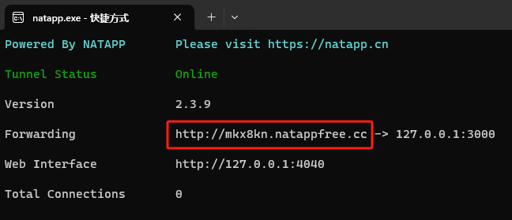

# 小程序-云音乐

## 小程序中使用 iconfont

由于小程序中不支持 css 文件，只支持 wxss 文件，所以我们可以将 iconfont 生成的 css 文件复制到小程序中，后缀改成 `.wxss`。

如果是全局使用，可以在 app.wxss 中使用 `@import` 引入：

```css title="app.wxss 中引入"
@import "/static/iconfont.wxss";
```

```html title="使用"
<text class="iconfont icon-icon-ranking"></text>
```

## 前后端交互

注意点：
- 协议必须是 `https` 协议，但开发时也可以设置不校验合法域名
- 一个接口最多配置 20 个域名
- 并发限制上限是 10 个

## 封装请求函数

```js title="utils/config.js"
export default {
  host: 'http://localhost:3000',
  mobileHost: 'http://pnxxvt.natappfree.cc'
}
```

```js title="utils/request.js"
import config from './config'

export default (url, data = {}, method = 'GET') => {
  return new Promise((resolve, reject) => {
    wx.request({
      url: config.host + url,
      data,
      method,
      success: (res) => {
        // console.log('请求成功:', res)
        resolve(res.data)
      },
      fail: (err) => {
        // console.log('请求失败:', err)
        reject(err)
      }
    })
  })
}
```

## 用户体验与性能的取舍

```js
// 获取排行榜数据
let index = 0
let resultArr = []
while (index < 5) {
  let topListData = await request('/top/list', { idx: index++ })
  let topListItem = {
    name: topListData.playlist.name,
    tracks: topListData.playlist.tracks.slice(0, 3)
  }
  resultArr.push(topListItem)
  // 如果将 setData 放在循环中，则不需要等待五次请求全部结束才更新，用户体验较好，但更新渲染次数会多一些
  this.setData({ topList: resultArr })
}

// 如果将 setData 放在循环外，则会导致发送请求的过程中页面长时间白屏，用户体验差，但只需更新渲染一次
// this.setData({ topList: resultArr })
```

## 前++ 和 后++ 记忆

前++ 和 后++ 的区别：如果先看到的是运算符就先运算再赋值，如果先看到的值那么就先赋值再运算。

## 内网穿透 & 真机调试

下载 [natapp](https://natapp.cn/) 并安装，随后双击打开。

真机调试时使用如下路径：



```js title="utils/config.js"
// 配置服务器相关信息
export default {
  host: 'http://localhost:3000',
  // highlight-next-line
  mobileHost: 'http://mkx8kn.natappfree.cc'
}
```

```js title="utils/request.js"
import config from './config'

export default (url, data = {}, method = 'GET') => {
  return new Promise((resolve, reject) => {
    wx.request({
      // highlight-next-line
      url: config.mobileHost + url,
      data,
      method,
      success: (res) => {
        resolve(res.data)
      },
      fail: (err) => {
        reject(err)
      }
    })
  })
}
```

## 多个视频同时播放的问题

正常来说，在播放新的视频之前，需要暂停上一个正在播放的视频。

实现这个需求的关键有两点：
1. 如何找到上一个视频的实例对象，让它暂停
2. 如何确认点击播放的视频和正在播放的视频不是同一个视频

我们可以使用单例模式：
1. 需要创建多个对象的场景下，通过一个变量接收，始终保持只有一个对象
2. 节省内存空间

```js title="示例代码"
handlePlay(event) {
  // 获取当前视频的 id
  let vid = event.currentTarget.id
  // 关闭上一个播放的视频
  // this.vid !== vid 表示点击的不是当前正在播放的视频
  // this.videoContext 表示已经存在视频实例，即已经有视频正在播放
  this.vid !== vid && this.videoContext && this.videoContext.stop()
  this.vid = vid
  // 根据视频 id，创建控制 video 标签的实例对象
  this.videoContext = wx.createVideoContext(vid)
  // 播放视频
  this.videoContext.play()
}
```

## 视频列表页面的性能优化

思路：当视频需要播放时，才显示 `video` 标签，否则以 `image` 标签代替。

```html
<video
  wx:if='{{videoId === item.data.vid}}'
  id="{{item.data.vid}}" src="{{item.data.urlInfo.url}}" poster="{{item.data.coverUrl}}" object-fit="cover"
  class="common"
  bindplay="handlePlay" bindtimeupdate="handleTimeUpdate" bindended="handleEnded"
></video>
<!-- 性能优化：使用 image 代替 video 标签 -->
<image
  wx:else
  id="{{item.data.vid}}" src="{{item.data.coverUrl}}"
  class="common"
  bindtap="handlePlay"
></image>
```

```js
// 当点击 image 替换成 video 时，其他正在播放的 video 实例会被销毁，所以无需使用 stop 方法暂停其他视频
handlePlay(event) {
  let vid = event.currentTarget.id
  // 更新 data 中 videoId 的状态数据
  this.setData({ videoId: vid })
  // 创建控制当前 video 标签的实例对象
  this.videoContext = wx.createVideoContext(vid)
  // 判断当前的视频之前是否播放过，是否有播放记录，如果有，跳转至指定的播放位置
  let { videoUpdateTime } = this.data
  let videoItem = videoUpdateTime.find(item => item.vid === vid)
  if (videoItem) this.videoContext.seek(videoItem.currentTime)
  this.videoContext.play()
}
```
