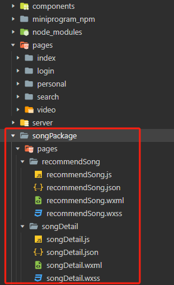

# 小程序-云音乐

## 小程序中使用 iconfont

由于小程序中不支持 css 文件，只支持 wxss 文件，所以我们可以将 iconfont 生成的 css 文件复制到小程序中，后缀改成 `.wxss`。

如果是全局使用，可以在 app.wxss 中使用 `@import` 引入：

```css title="app.wxss 中引入"
@import "/static/iconfont.wxss";
```

```html title="使用"
<text class="iconfont icon-icon-ranking"></text>
```

## 前后端交互

注意点：
- 协议必须是 `https` 协议，但开发时也可以设置不校验合法域名
- 一个接口最多配置 20 个域名
- 并发限制上限是 10 个

## 封装请求函数

```js title="utils/config.js"
export default {
  host: 'http://localhost:3000',
  mobileHost: 'http://pnxxvt.natappfree.cc'
}
```

```js title="utils/request.js"
import config from './config'

export default (url, data = {}, method = 'GET') => {
  return new Promise((resolve, reject) => {
    wx.request({
      url: config.host + url,
      data,
      method,
      success: (res) => {
        // console.log('请求成功:', res)
        resolve(res.data)
      },
      fail: (err) => {
        // console.log('请求失败:', err)
        reject(err)
      }
    })
  })
}
```

## 用户体验与性能的取舍

```js
// 获取排行榜数据
let index = 0
let resultArr = []
while (index < 5) {
  let topListData = await request('/top/list', { idx: index++ })
  let topListItem = {
    name: topListData.playlist.name,
    tracks: topListData.playlist.tracks.slice(0, 3)
  }
  resultArr.push(topListItem)
  // 如果将 setData 放在循环中，则不需要等待五次请求全部结束才更新，用户体验较好，但更新渲染次数会多一些
  this.setData({ topList: resultArr })
}

// 如果将 setData 放在循环外，则会导致发送请求的过程中页面长时间白屏，用户体验差，但只需更新渲染一次
// this.setData({ topList: resultArr })
```

## 前++ 和 后++ 记忆

前++ 和 后++ 的区别：如果先看到的是运算符就先运算再赋值，如果先看到的值那么就先赋值再运算。

## 内网穿透 & 真机调试

下载 [natapp](https://natapp.cn/) 并安装，随后双击打开。

真机调试时使用如下路径：


```js title="utils/config.js"
// 配置服务器相关信息
export default {
  host: 'http://localhost:3000',
  // highlight-next-line
  mobileHost: 'http://mkx8kn.natappfree.cc'
}
```

```js title="utils/request.js"
import config from './config'

export default (url, data = {}, method = 'GET') => {
  return new Promise((resolve, reject) => {
    wx.request({
      // highlight-next-line
      url: config.mobileHost + url,
      data,
      method,
      success: (res) => {
        resolve(res.data)
      },
      fail: (err) => {
        reject(err)
      }
    })
  })
}
```

## 多个视频同时播放的问题

正常来说，在播放新的视频之前，需要暂停上一个正在播放的视频。

实现这个需求的关键有两点：
1. 如何找到上一个视频的实例对象，让它暂停
2. 如何确认点击播放的视频和正在播放的视频不是同一个视频

我们可以使用单例模式：
1. 需要创建多个对象的场景下，通过一个变量接收，始终保持只有一个对象
2. 节省内存空间

```js title="示例代码"
handlePlay(event) {
  // 获取当前视频的 id
  let vid = event.currentTarget.id
  // 关闭上一个播放的视频
  // this.vid !== vid 表示点击的不是当前正在播放的视频
  // this.videoContext 表示已经存在视频实例，即已经有视频正在播放
  this.vid !== vid && this.videoContext && this.videoContext.stop()
  this.vid = vid
  // 根据视频 id，创建控制 video 标签的实例对象
  this.videoContext = wx.createVideoContext(vid)
  // 播放视频
  this.videoContext.play()
}
```

## 视频列表页面的性能优化

思路：当视频需要播放时，才显示 `video` 标签，否则以 `image` 标签代替。

```html
<video
  wx:if='{{videoId === item.data.vid}}'
  id="{{item.data.vid}}" src="{{item.data.urlInfo.url}}" poster="{{item.data.coverUrl}}" object-fit="cover"
  class="common"
  bindplay="handlePlay" bindtimeupdate="handleTimeUpdate" bindended="handleEnded"
></video>
<!-- 性能优化：使用 image 代替 video 标签 -->
<image
  wx:else
  id="{{item.data.vid}}" src="{{item.data.coverUrl}}"
  class="common"
  bindtap="handlePlay"
></image>
```

```js
// 当点击 image 替换成 video 时，其他正在播放的 video 实例会被销毁，所以无需使用 stop 方法暂停其他视频
handlePlay(event) {
  let vid = event.currentTarget.id
  // 更新 data 中 videoId 的状态数据
  this.setData({ videoId: vid })
  // 创建控制当前 video 标签的实例对象
  this.videoContext = wx.createVideoContext(vid)
  // 判断当前的视频之前是否播放过，是否有播放记录，如果有，跳转至指定的播放位置
  let { videoUpdateTime } = this.data
  let videoItem = videoUpdateTime.find(item => item.vid === vid)
  if (videoItem) this.videoContext.seek(videoItem.currentTime)
  this.videoContext.play()
}
```

## 路由传参

小程序中对路由传参的参数长度有限制，如果参数长度过长，会被截取。

```js
// 不推荐
wx.navigateTo({ url: '/songPackage/pages/songDetail/songDetail?song=' + JSON.stringify(song) })

// 推荐
wx.navigateTo({ url: '/songPackage/pages/songDetail/songDetail?musicId=' + song.id })
```

传递的参数可以在跳转页面的 `onLoad` 中接收到（`options`）。

## 小程序使用 npm 包

以 pubsub 为例，实现小程序页面之间的通信：

1. 初始化 package.json：`npm init`
2. 勾选允许使用 npm
3. 下载 npm 包：`npm install pubsub-js`
4. 构建 npm：“开发工具 -> 工具 -> 构建 npm”，会将 `node_modules` 中的包打包到 `miniprogram_npm` 中，随后小程序就到 `miniprogram_npm` 中寻找对应的包
5. 使用

    ```js title="pageA"
    import PubSub from 'pubsub-js'
    
    // 订阅
    PubSub.subscribe('switchType', (msg, type) => {
      // ...
    })
    ```
    
    ```js title="pageB"
    import PubSub from 'pubsub-js'
    
    // 发布
    PubSub.publish('switchType', 'next')
    ```

## 用户登录获取用户唯一标识（openId）

前端调用 `wx.login` 接口让用户登录，获取用户的 `code`。

```js title="前端代码示例"
// 获取用户 openId
handleGetOpenId() {
  // 获取登录凭证
  wx.login({
    success: async (res) => {
      let code = res.code
      // 将登录凭证发送服务器
      let result = await request('/getOpenId', { code })
      console.log(result)
    }
  })
}
```

后端收到前端传过来的 `code`，然后拿着小程序的 `appId` 和 `appSecret` 向微信服务器发请求，获取到用户的 `openId`，与用户信息一起进行加密，生成用户 `token` 返回给前端。（`token` 是用户身份的标识）

```js title="后端代码示例"
// 注册获取用户唯一标识的接口
app.use('/getOpenId', async (req, res, next) => {
  let code = req.query.code
  let appId = 'wx810e8b1fde386fde'
  let appSecret = '8bb909649da12002fba7a47f5ac3791b'
  let url = `https://api.weixin.qq.com/sns/jscode2session?appid=${appId}&secret=${appSecret}&js_code=${code}&grant_type=authorization_code`
  // 发请求给微信服务器获取 openId
  let result = await fly.get(url)
  let openId = JSON.parse(result.data).openid
   console.log('openId', openId)
   // 自定义登录态
   let person = { username: '张三', age: 18, openId }
   // 对用户的数据进行加密，生成 token 返回给客户端
  let token = jwt.sign(person, 'atguigu')
  console.log(token)
  // 验证身份，反编译 token
  let result2 = jwt.verify(token, 'atguigu')
  console.log(result2)
  res.send(token)
})
```

## 分包

### 常规分包

在 app.json 的 `subpackages` 中声明项目分包结构。

特点：
- 小程序在加载时先加载主包，当需要访问分包页面的时候再加载分包；
- 分包的页面可以访问主包的文件、数据、图片等资源；
- 主包：
  - 主包来源：除了分包以外，其他内容都会打包到主包中
  - 一般来说，首页、tabBar 通常会放在主包，一上来不显示的页面可以进行分包

目录结构：



```json
{
   // 主包
   "pages": [
      "pages/login/login",
      "pages/index/index",
      "pages/search/search",
      "pages/video/video",
      "pages/personal/personal"
   ],
   // 分包
   // 分包的页面路径，就不需要再包含在主包中了
   "subpackages": [
      {
         "root": "songPackage",
         "pages": [
            "pages/recommendSong/recommendSong",
            "pages/songDetail/songDetail"
         ]
      },
      // 可以有多个分包
      {
         "root": "otherPackage",
         "name": "other",
         "pages": [
            "pages/other/other"
         ]
      }
   ]
}
```

分包后，页面跳转的路径需要更改：

```js
// 修改前
wx.navigateTo({ url: '/pages/recommendSong/recommendSong' })

// 修改后
wx.navigateTo({ url: '/songPackage/pages/recommendSong/recommendSong' })
```

### 独立分包

设置 `independent` 为 `true`。

特点：
- 可单独访问分包的内容，不需要下载主包；
- 不能依赖主包或其他包的内容。

使用场景：通常某些页面和当前小程序的其他页面关联不大时，可进行独立分包，比如临时加的广告页、活动页等。

```json
{
   // 主包
   "pages": [
      "pages/login/login",
      "pages/index/index",
      "pages/search/search",
      "pages/video/video",
      "pages/personal/personal"
   ],
   // 分包
   "subpackages": [
      {
         "root": "songPackage",
         "pages": [
            "pages/recommendSong/recommendSong",
            "pages/songDetail/songDetail"
         ],
         // 独立分包
         "independent": true
      },
      {
         "root": "otherPackage",
         "name": "other",
         "pages": [
            "pages/other/other"
         ]
      }
   ]
}
```

以上代码，将 songPackage 进行独立分包，那么独立分包中的页面不能依赖其他包，例如无法使用公共样式，需要单独引入：

```css title="recommendSong.wxss"
@import "/static/iconfont/iconfont.wxss";
```

```css title="songDetail.wxss"
@import "/static/iconfont/iconfont.wxss";
```

### 分包预下载

app.json 中设置 `preloadRule` 选项。

注意：在独立分包时，可以预加载主包。

```json
{
  "pages": [
    "pages/index/index",
    "pages/search/search",
    "pages/video/video",
    "pages/login/login",
    "pages/personal/personal"
  ],
  "subpackages": [
    {
      "root": "songPackage",
      "pages": [
        "pages/recommendSong/recommendSong",
        "pages/songDetail/songDetail"
      ],
      "independent": true
    },
    {
      "root": "otherPackage",
      "name": "other",
      "pages": [
        "pages/other/other"
      ]
    }
  ],
  "preloadRule": {
    // 在 index 页面预加载 songPackage 和 other 包
    "pages/index/index": {
      // 可以通过包的 root 或 name 指定包
      "packages": ["songPackage", "other"]
    }
  }
}
```
