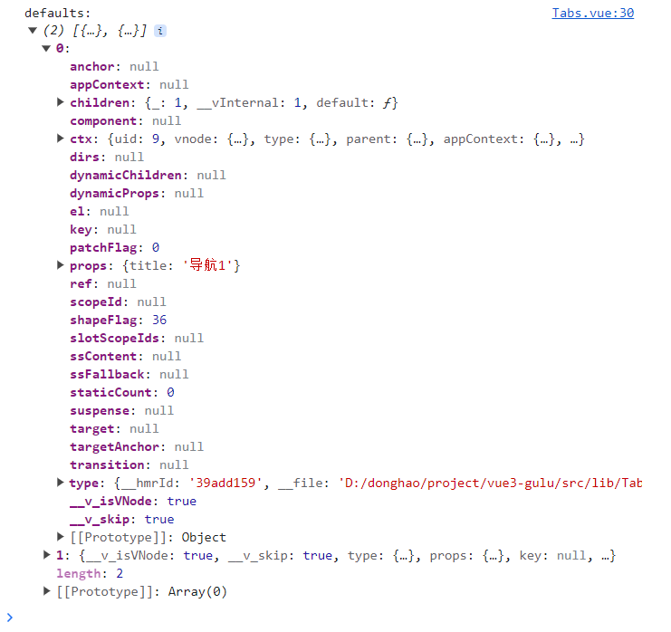

# 糯米 UI

## 允许 vue 组件名为单个单词

```js title=".eslintrc.cjs"
module.exports = {
  // ...
  rules: {
    'vue/multi-word-component-names': 'off',
  }
}
```

## 网页字体设置

详见：[Fonts.css -- 跨平台中文字体解决方案](https://github.com/zenozeng/fonts.css/)

```css
body {
  font-size: 16px;
  font-family: -apple-system, "Noto Sans", "Helvetica Neue", Helvetica, "Nimbus Sans L", Arial, "Liberation Sans", "PingFang SC", "Hiragino Sans GB", "Noto Sans CJK SC", "Source Han Sans SC", "Source Han Sans CN", "Microsoft YaHei", "Wenquanyi Micro Hei", "WenQuanYi Zen Hei", "ST Heiti", SimHei, "WenQuanYi Zen Hei Sharp", sans-serif;
}
```

## Vue2 和 Vue3 的区别

- 新 v-model 代替以前的 v-model 和 .sync
- defineProps、defineEmits

## 批量绑定属性

```html title="全都绑定到一个元素上"
<template>
  <button v-bind="$attrs">click me</button>
</template>
```

```html title="分开绑定到两个元素上"
<template>
  <div :size="size" :level="level">
    <button v-bind="rest">click me</button>
  </div>
</template>

<script setup>
import { useAttrs } from 'vue'

const attrs = useAttrs()
const { size, level, ...rest } = attrs
</script>
```

## UI 库的 CSS 不能添加 scoped

因为 data-v-xxx 中的 xxx 每次运行可能会变，必须输出稳定不变的 class 选择器，方便使用者覆盖。

## CSS 最小影响原则

库的 CSS 一定不要影响到使用者的 CSS。

比如，库的 CSS 需要下面这段代码，于是创建了 gulu.css 供使用者引入。

```css title="gulu.css"
* { margin: 0; padding: 0; box-sizing: border-box; }
```

一旦库的使用者引入了 gulu.css，那么就相当于使用了上面这段代码，影响了使用者的样式。

所以 gulu.css 可以改写成下面这样：

```css title="gulu.css"
[class^="gulu-"], [class*=" gulu-"] {
  margin: 0;
  padding: 0;
  box-sizing: border-box;
  font-size: 16px;
  font-family: -apple-system, "Noto Sans", "Helvetica Neue",
  Helvetica, "Nimbus Sans L", Arial, "Liberation Sans", "PingFang SC",
  "Hiragino Sans GB", "Noto Sans CJK SC", "Source Han Sans SC",
  "Source Han Sans CN", "Microsoft YaHei", "Wenquanyi Micro Hei",
  "WenQuanYi Zen Hei", "ST Heiti", SimHei, "WenQuanYi Zen Hei Sharp", sans-serif;
}
```

以上代码，只影响了 class 为 `gulu-` 开头或 class 中包含了 ` gulu-` 的选择器的样式。

## 使用 JS 的方式打开 Dialog

```ts
import { createApp, h } from 'vue';
import Dialog from './Dialog.vue';

export const openDialog = options => {
  const { title, content, ok, cancel } = options;
  const div = document.createElement('div');
  document.body.appendChild(div);
  const close = () => {
    app.unmount(div);
    div.remove();
  };
  const app = createApp({
    render() {
      return h(
        Dialog,
        {
          visible: true,
          'onUpdate:visible': (newVisible) => {
            if (newVisible === false) {
              close();
            }
          },
          ok,
          cancel,
        },
        { title, content }
      );
    },
  });
  app.mount(div);
};
```

## useSlots

问题：如何确认子组件的类型？比如，如何确定 `Tabs` 组件的子组件一定是 `Tab` 组件？

使用 `useSlots()` 可以获取组件外部传递的插槽内容。

```ts
import { useSlots } from 'vue';
import Tab from './Tab.vue';

const slots = useSlots();
const defaults = slots.default?.();   // slots.default 是一个函数
console.log('defaults:', defaults);

if (defaults) {
  defaults.forEach(tag => {
    if (tag.type !== Tab) {   // type 属性的值就是每个子组件的实例对象
      throw new Error('Tabs 子标签必须是 Tab');
    }
  });
}
```



## ref 复杂写法

```html
<div
  v-for="(itemTitle, index) in titles" :key="index"
  :ref="
    (el) => {
      if (itemTitle === selected) selectedItem = el;
    }
  "
  :class="{ selected: itemTitle === selected }" class="gulu-tabs-nav-item"
  @click="select(itemTitle)"
>
  {{ itemTitle }}
</div>
```

## 动态组件绑定 key

当使用 `<component :is="vnode">` 并且传递相同类型的 vnode 时，需要提供一个唯一的 `key` 属性。

在 Vue 中，`<component>` 元素可以根据动态的 `is` 属性来渲染不同的组件。当你在父组件中通过 `:is` 绑定一个 vnode，并且这个 vnode 的类型与之前已经渲染过的 vnode 类型相同，Vue 会复用之前已经生成的组件实例。然而，如果没有提供唯一的 key 属性，Vue 无法正确识别和跟踪这个 vnode，可能会导致渲染错误或出现意料之外的行为。

```html
<component :is="current" :key="current.props.title" />
```

## 圆弧效果

```css title="border-radius"
div {
  border-radius: 100px 40px; 
}
```

```css title="clip-path"
div {
  clip-path: ellipse(80% 60% at 50% 40%); 
}
```

## 代码高亮

- [如何用vite的vueCustomBlockTransforms（自定义块转换）实现源代码展示 ](https://www.cnblogs.com/cosmicbison/p/17406155.html)

## build 之后不加载 md 文件

这是因为 build 的时候用的是 rollup，rollup 不支持 `import()` 时拼接字符串。

## 部署到 Github gh-pages 分支

- [github使用gh-pages部署静态站点](https://juejin.cn/post/7288609174124331023)
- [Vue3 vite build 之后不显示页面内容，只显示空白，也没有报错如何解决](https://blog.csdn.net/KimBing/article/details/130085256)

## 引入 Github 的 markdown 样式

1. 安装 [github-markdown-css](https://github.com/sindresorhus/github-markdown-css)

    ```shell
    npm install github-markdown-css
    ```

2. 在 main.ts 中引入

    ```ts title="main.ts"
    import 'github-markdown-css'
    ```

3. 在标签上添加 `class="markdown-body"`

    ```html
    <template>
      <article class="markdown-body">
        <h1>安装</h1>
        <p>打开终端运行下列命令：</p>
        <pre><code>npm install nuomi-ui-vue</code></pre>
        <p>或</p>
        <pre><code>yarn add nuomi-ui-vue</code></pre>
        <p>或</p>
        <pre><code>pnpm install nuomi-ui-vue</code></pre>
        <p>下一节：<a href="#/doc/get-started">开始使用</a></p>
      </article>
    </template>
    ```

## 支持引入 markdown 文件

1. 安装 marked

   ```shell
   pnpm install marked
   ```

2. 自定义 Vite 插件

   ```ts title="nuomi-ui-vue/plugins/md.ts"
   import { marked } from 'marked';
   
   export default function () {
     return {
       name: 'vitePluginMd2Vue',
       transform(code: string, id: string) {
         if (id.endsWith('.md')) {
           return {
             code: `import {h, defineComponent} from "vue";
                   const _sfc_md = defineComponent({
                       name: "Markdown",
                   });
   
                   const _sfc_render =() => {
                       return h("div", {
                         innerHTML: ${JSON.stringify(marked(code))}, 
                       })
                   };
   
                   _sfc_md.render = _sfc_render
                   export default _sfc_md`,
             map: null
           };
         }
       }
     };
   }
   ```

3. 在 vite.config.ts 中引入自定义的插件

   ```ts title="vite.config.ts"
   import { fileURLToPath, URL } from 'node:url'
   
   import { defineConfig } from 'vite'
   import vue from '@vitejs/plugin-vue'
   
   // 引入 md 插件
   import md from './plugins/md';

   export default defineConfig({
     base: './',
     plugins: [
       vue(),
       md()   // 使用 md 插件
     ],
     resolve: {
       alias: {
         '@': fileURLToPath(new URL('./src', import.meta.url))
       }
     }
   })
   ```

4. 在 vue 组件中引入 markdown 文件

   ```html
   <script setup lang="ts">
   import md from '@/markdown/install.md';
   </script>
   
   <template>
     <article v-html="md.render().props.innerHTML" class="markdown-body"></article>
   </template>
   ```

## 关于 Vite

Vite 在开发的时候用的是浏览器的原生能力，在部署的时候用的是 rollup 进行打包。

所以有时候需要注意，有的功能在开发时有用，打包部署后可能就没用了。

- [vite的打包过程？rollup是什么？](https://blog.csdn.net/qq_43651168/article/details/130805092#:~:text=vite%E7%9A%84%E6%89%93%E5%8C%85%E8%BF%87%E7%A8%8B%201%20%E5%BC%80%E5%8F%91%E7%8E%AF%E5%A2%83%EF%BC%88Development%EF%BC%89%EF%BC%9A%20%E5%90%AF%E5%8A%A8Vite%E5%BC%80%E5%8F%91%E6%9C%8D%E5%8A%A1%E5%99%A8%EF%BC%9A%E8%BF%90%E8%A1%8C%20npm%20run%20dev%20%E6%88%96%E7%B1%BB%E4%BC%BC%E7%9A%84%E5%91%BD%E4%BB%A4%E5%90%AF%E5%8A%A8Vite%E5%BC%80%E5%8F%91%E6%9C%8D%E5%8A%A1%E5%99%A8%E3%80%82,%E6%9E%84%E5%BB%BA%E5%BA%94%E7%94%A8%E7%A8%8B%E5%BA%8F%EF%BC%9A%E8%BF%90%E8%A1%8C%20npm%20run%20build%20%E6%88%96%E7%B1%BB%E4%BC%BC%E7%9A%84%E5%91%BD%E4%BB%A4%EF%BC%8CVite%E4%BC%9A%E6%89%A7%E8%A1%8C%E6%9E%84%E5%BB%BA%E8%BF%87%E7%A8%8B%E3%80%82%20Rollup%E6%89%93%E5%8C%85%EF%BC%9AVite%E5%9C%A8%E7%94%9F%E4%BA%A7%E7%8E%AF%E5%A2%83%E4%B8%AD%E4%BD%BF%E7%94%A8Rollup%E8%BF%9B%E8%A1%8C%E6%89%93%E5%8C%85%E3%80%82%20Rollup%E6%98%AF%E4%B8%80%E4%B8%AA%E5%BC%BA%E5%A4%A7%E7%9A%84JavaScript%E6%A8%A1%E5%9D%97%E6%89%93%E5%8C%85%E5%99%A8%EF%BC%8C%E5%AE%83%E5%B0%86%E5%BA%94%E7%94%A8%E7%A8%8B%E5%BA%8F%E4%B8%AD%E7%9A%84%E6%89%80%E6%9C%89%E6%A8%A1%E5%9D%97%E6%89%93%E5%8C%85%E6%88%90%E4%B8%80%E4%B8%AA%E6%88%96%E5%A4%9A%E4%B8%AAbundle%E6%96%87%E4%BB%B6%EF%BC%8C%E4%BB%A5%E4%BE%BF%E5%9C%A8%E7%94%9F%E4%BA%A7%E7%8E%AF%E5%A2%83%E4%B8%AD%E4%BD%BF%E7%94%A8%E3%80%82%20)

## markdown 文件的类型声明

```ts title="env.d.ts"
declare module '*.md' {
  const content: string;
  export default content;
}
```

## 展示源代码

1. 安装 `prismjs`、`@vue/compiler-core`

   ```shell
   pnpm install prismjs
   pnpm install -D @vue/compiler-core
   ```

2. 自定义 Vite 插件

   ```ts title="nuomi-ui-vue/plugins/vueDemo.ts"
   import fs from 'fs';
   import { baseParse } from '@vue/compiler-core';
   
   const vueDemoPlugin = {
     name: 'vue-block-demo',
     transform(code: string, path: string) {
       if (!/vue&type=demo/.test(path)) {
         return;
       }
       const filePath = path.split('?')[0];
       // 异步读取文件内容，并转为 string 类型
       const file = fs.readFileSync(filePath).toString();
       // 将读取到的文件中的自定义快渲染为 AST
       const parsed: any = baseParse(file).children.find((n: any) => n.tag === 'demo');
       // 读取自定义模块中的文本内容
       const title = parsed.children[0].content;
       // 将读取文件中的自定义块切分，并转为字符串类型
       const main = file.split(parsed.loc.source).join('').trim();
       // 以 JSON 数据类型返回
       return `export default Component => {
               Component.__sourceCode = ${JSON.stringify(main)}
               Component.__sourceCodeTitle = ${JSON.stringify(title)}
           }`;
     },
   };
   
   export default vueDemoPlugin;
   ```

3. 在 vite.config.ts 中使用插件

   ```ts title="vite.config.ts"
   import { fileURLToPath, URL } from 'node:url'
   
   import { defineConfig } from 'vite'
   import vue from '@vitejs/plugin-vue'
   
   import md from './plugins/md';
   // 引入插件
   import vueDemo from './plugins/vueDemo';
   
   export default defineConfig({
     base: './',
     plugins: [
       vue(),
       md(),
       vueDemo    // 使用插件
     ],
     resolve: {
       alias: {
         '@': fileURLToPath(new URL('./src', import.meta.url))
       }
     }
   })
   ```

4. 定义组件

   ```html title="src/components/VueDemo"
   <script setup lang="ts">
   import { computed, ref } from 'vue';
   import 'prismjs';
   import 'prismjs/themes/prism-tomorrow.css';
   import NButton from '@/lib/NButton.vue';
   
   const props = defineProps<{
     component: any
   }>();
   
   const Prism = (window as any).Prism;
   const html = computed(() => {
     return Prism.highlight(props.component.__sourceCode, Prism.languages.html, 'html');
   });
   const codeVisible = ref(false);
   const toggleCode = () => (codeVisible.value = !codeVisible.value);
   </script>
   
   <template>
     <div class="demo">
       <h2>{{ component.__sourceCodeTitle }}</h2>
       <div class="demo-component">
         <component :is="component" />
       </div>
       <div class="demo-actions">
         <n-button @click="toggleCode">{{ codeVisible ? '隐藏' : '查看' }}代码</n-button>
       </div>
       <div v-if="codeVisible" class="demo-code">
         <pre class="language-html" v-html="html" />
       </div>
     </div>
   </template>
   
   <style scoped lang="scss">
   $border-color: #d9d9d9;
   
   .demo {
     border: 1px solid $border-color;
     margin: 16px 0 32px;
     > h2 {
       font-size: 20px;
       border-bottom: 1px solid $border-color;
       padding: 8px 16px;
     }
     &-component {
       padding: 16px;
     }
     &-actions {
       border-top: 1px dashed $border-color;
       padding: 8px 16px;
     }
     &-code {
       border-top: 1px dashed $border-color;
       overflow: auto;
       padding: 8px 16px;
       > pre {
         font-family: Consolas, "Courier New", Courier, monospace;
         line-height: 1.1;
         margin: 0;
       }
     }
   }
   </style>
   ```

5. 使用组件

   ```html
   <script setup lang="ts">
   import VueDemo from '@/components/VueDemo.vue';
   import ButtonDemo1 from './ButtonDemo1.vue';
   import ButtonDemo2 from './ButtonDemo2.vue';
   import ButtonDemo3 from './ButtonDemo3.vue';
   </script>
   
   <template>
     <h2>Button 组件示例</h2>
     <vue-demo :component="ButtonDemo1" />
     <vue-demo :component="ButtonDemo2" />
     <vue-demo :component="ButtonDemo3" />
   </template>
   ```

## 使用 rollup 打包库文件（UI 组件）

1. 导出 UI 组件

   ```ts title="src/lib/index.ts"
   export { default as NButton } from './NButton.vue';
   
   // 相当于
   // import NButton from './NButton.vue';
   // export { NButton }
   ```

2. 安装插件，供 rollup 使用

   ```shell
   pnpm install -D rollup-plugin-esbuild rollup-plugin-vue rollup-plugin-scss sass rollup-plugin-terser
   ```

3. 创建 rollup 打包配置文件

   在项目根目录下创建 rollup.config.js，告诉 rollup 如何打包：

   ```ts title="rollup.config.js"
   // rollup-plugin-esbuild：将 JS/TS 代码转换成高效的 JS，并提供了压缩代码的能力
   import esbuild from 'rollup-plugin-esbuild'
   // rollup-plugin-vue：用于将 vue 单文件组件转换成 JS 模块，以便在浏览器中使用
   import vue from 'rollup-plugin-vue'
   // rollup-plugin-scss：用于将 SCSS 转换成 CSS
   import scss from 'rollup-plugin-scss'
   // sass：用于支持 rollup-plugin-scss 插件
   import dartSass from 'sass'
   // rollup-plugin-terser：用于对 JS 代码进行压缩和混淆
   import { terser } from 'rollup-plugin-terser'
   
   export default {
     input: 'src/lib/index.ts',
     output: {
       globals: {
         vue: 'Vue'
       },
       name: 'nuomi',
       file: 'dist/lib/nuomi.js',
       format: 'umd',
       plugins: [terser()]
     },
     plugins: [
       scss({ fileName: 'nuomi.css', include: /\.scss$/, sass: dartSass }),
       vue({ include: /\.vue$/ }),
       esbuild({
         include: /\.[jt]s$/,
         minify: process.env.NODE_ENV === 'production',
         target: 'es2015'
       }),
     ],
   };
   ```

4. 使用 rollup 打包

   如果没有安装 rollup，请先全局安装（或者局部安装）：
   
   ```shell
   npm i -g rollup
   
   # OR
   yarn global add rollup
   ```
   
   然后在命令行运行以下命令进行打包：
   
   ```shell
   rollup -c
   ```
   
   随后将打包后的代码发布到 npm 即可。
