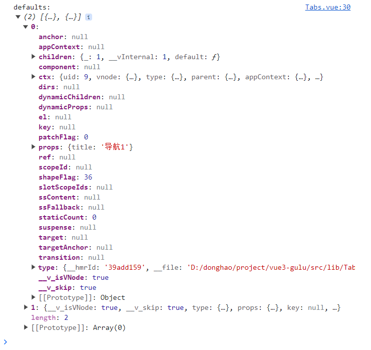

## 允许 vue 组件名为单个单词

```js title=".eslintrc.cjs"
module.exports = {
  // ...
  rules: {
    'vue/multi-word-component-names': 'off',
  }
}
```

## 网页字体设置

详见：[Fonts.css -- 跨平台中文字体解决方案](https://github.com/zenozeng/fonts.css/)

```css
body {
  font-size: 16px;
  font-family: -apple-system, "Noto Sans", "Helvetica Neue", Helvetica, "Nimbus Sans L", Arial, "Liberation Sans", "PingFang SC", "Hiragino Sans GB", "Noto Sans CJK SC", "Source Han Sans SC", "Source Han Sans CN", "Microsoft YaHei", "Wenquanyi Micro Hei", "WenQuanYi Zen Hei", "ST Heiti", SimHei, "WenQuanYi Zen Hei Sharp", sans-serif;
}
```

## Vue2 和 Vue3 的区别

- 新 v-model 代替以前的 v-model 和 .sync
- defineProps、defineEmits

## 批量绑定属性

```html title="全都绑定到一个元素上"
<template>
  <button v-bind="$attrs">click me</button>
</template>
```

```html title="分开绑定到两个元素上"
<template>
  <div :size="size" :level="level">
    <button v-bind="rest">click me</button>
  </div>
</template>

<script setup>
import { useAttrs } from 'vue'

const attrs = useAttrs()
const { size, level, ...rest } = attrs
</script>
```

## UI 库的 CSS 不能添加 scoped

因为 data-v-xxx 中的 xxx 每次运行可能会变，必须输出稳定不变的 class 选择器，方便使用者覆盖。

## CSS 最小影响原则

库的 CSS 一定不要影响到使用者的 CSS。

比如，库的 CSS 需要下面这段代码，于是创建了 gulu.css 供使用者引入。

```css title="gulu.css"
* { margin: 0; padding: 0; box-sizing: border-box; }
```

一旦库的使用者引入了 gulu.css，那么就相当于使用了上面这段代码，影响了使用者的样式。

所以 gulu.css 可以改写成下面这样：

```css title="gulu.css"
[class^="gulu-"], [class*=" gulu-"] {
  margin: 0;
  padding: 0;
  box-sizing: border-box;
  font-size: 16px;
  font-family: -apple-system, "Noto Sans", "Helvetica Neue",
  Helvetica, "Nimbus Sans L", Arial, "Liberation Sans", "PingFang SC",
  "Hiragino Sans GB", "Noto Sans CJK SC", "Source Han Sans SC",
  "Source Han Sans CN", "Microsoft YaHei", "Wenquanyi Micro Hei",
  "WenQuanYi Zen Hei", "ST Heiti", SimHei, "WenQuanYi Zen Hei Sharp", sans-serif;
}
```

以上代码，只影响了 class 为 `gulu-` 开头或 class 中包含了 ` gulu-` 的选择器的样式。

## 使用 JS 的方式打开 Dialog

```ts
import { createApp, h } from 'vue';
import Dialog from './Dialog.vue';

export const openDialog = options => {
  const { title, content, ok, cancel } = options;
  const div = document.createElement('div');
  document.body.appendChild(div);
  const close = () => {
    app.unmount(div);
    div.remove();
  };
  const app = createApp({
    render() {
      return h(
        Dialog,
        {
          visible: true,
          'onUpdate:visible': (newVisible) => {
            if (newVisible === false) {
              close();
            }
          },
          ok,
          cancel,
        },
        { title, content }
      );
    },
  });
  app.mount(div);
};
```

## useSlots

问题：如何确认子组件的类型？比如，如何确定 `Tabs` 组件的子组件一定是 `Tab` 组件？

使用 `useSlots()` 可以获取组件外部传递的插槽内容。

```ts
import { useSlots } from 'vue';
import Tab from './Tab.vue';

const slots = useSlots();
const defaults = slots.default?.();   // slots.default 是一个函数
console.log('defaults:', defaults);

if (defaults) {
  defaults.forEach(tag => {
    if (tag.type !== Tab) {   // type 属性的值就是每个子组件的实例对象
      throw new Error('Tabs 子标签必须是 Tab');
    }
  });
}
```



## ref 复杂写法

```html
<div
  v-for="(itemTitle, index) in titles" :key="index"
  :ref="
    (el) => {
      if (itemTitle === selected) selectedItem = el;
    }
  "
  :class="{ selected: itemTitle === selected }" class="gulu-tabs-nav-item"
  @click="select(itemTitle)"
>
  {{ itemTitle }}
</div>
```

## 动态组件绑定 key

当使用 `<component :is="vnode">` 并且传递相同类型的 vnode 时，需要提供一个唯一的 `key` 属性。

在 Vue 中，`<component>` 元素可以根据动态的 `is` 属性来渲染不同的组件。当你在父组件中通过 `:is` 绑定一个 vnode，并且这个 vnode 的类型与之前已经渲染过的 vnode 类型相同，Vue 会复用之前已经生成的组件实例。然而，如果没有提供唯一的 key 属性，Vue 无法正确识别和跟踪这个 vnode，可能会导致渲染错误或出现意料之外的行为。

```html
<component :is="current" :key="current.props.title" />
```

## 圆弧效果

```css title="border-radius"
div {
  border-radius: 100px 40px; 
}
```

```css title="clip-path"
div {
  clip-path: ellipse(80% 60% at 50% 40%); 
}
```

## 代码高亮

- [如何用vite的vueCustomBlockTransforms（自定义块转换）实现源代码展示 ](https://www.cnblogs.com/cosmicbison/p/17406155.html)

## build 之后不加载 md 文件

这是因为 build 的时候用的是 rollup，rollup 不支持 `import()` 时拼接字符串。

## 部署到 Github gh-pages 分支

- [github使用gh-pages部署静态站点](https://juejin.cn/post/7288609174124331023)
