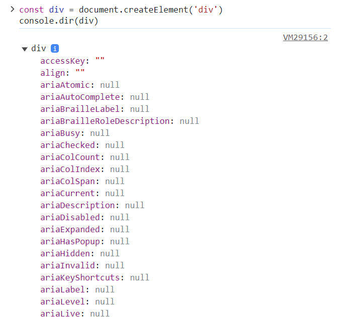

# 虚拟 DOM & Diff 算法

## 虚拟 DOM

虚拟 DOM 就是通过 JS 来生成一个 AST 节点树。

为什么要有虚拟 DOM？因为真实 DOM 身上的属性非常多（下图只截取了部分属性），直接操作 DOM 非常消耗性能。



解决方案就是，我们可以利用 JS 的计算性能（操作 JS 是非常快的）来换取操作 DOM 所消耗的性能。既然逃不掉操作 DOM 这道坎，那我们就尽可能少的操作 DOM。

## Diff 算法

Diff 算法可以分为两种：有 `key` 的和没有 `key` 的。

```ts title="源码：packages/runtime-core/src/renderer.ts"
const patchChildren: PatchChildrenFn = (
  n1,
  n2,
  container,
  anchor,
  parentComponent,
  parentSuspense,
  isSVG,
  slotScopeIds,
  optimized = false
) => {
  // ...

  const { patchFlag, shapeFlag } = n2;
  if (patchFlag > 0) {
    if (patchFlag & PatchFlags.KEYED_FRAGMENT) {
      // highlight-start
      // 有 key 的 Diff 算法
      patchKeyedChildren(
        c1 as VNode[],
        c2 as VNodeArrayChildren,
        container,
        anchor,
        parentComponent,
        parentSuspense,
        isSVG,
        slotScopeIds,
        optimized
      );
      // highlight-end
      return;
    } else if (patchFlag & PatchFlags.UNKEYED_FRAGMENT) {
      // highlight-start
      // 没有 key 的 Diff 算法
      patchUnkeyedChildren(
        c1 as VNode[],
        c2 as VNodeArrayChildren,
        container,
        anchor,
        parentComponent,
        parentSuspense,
        isSVG,
        slotScopeIds,
        optimized
      );
      // highlight-end
      return;
    }
  }
  // ...
};
```

### 没有 key 的 Diff 算法

没有 `key` 的 Diff 算法可以分为以下三步：

```ts title="源码：packages/runtime-core/src/renderer.ts"
const patchUnkeyedChildren = (
  c1: VNode[],              // 旧的 VNode
  c2: VNodeArrayChildren,   // 新的 VNode
  container: RendererElement,
  anchor: RendererNode | null,
  parentComponent: ComponentInternalInstance | null,
  parentSuspense: SuspenseBoundary | null,
  isSVG: boolean,
  slotScopeIds: string[] | null,
  optimized: boolean
) => {
  // ...
  
  // 1. 通过 for 循环重新生成 VNode
  for (i = 0; i < commonLength; i++) {
    const nextChild = (c2[i] = optimized ? cloneIfMounted(c2[i] as VNode) : normalizeVNode(c2[i]));
    patch(
      c1[i], nextChild, container, null, parentComponent,
      parentSuspense, isSVG, slotScopeIds, optimized
    );
  }
  if (oldLength > newLength) {
    // 2. 如果旧的 VNode 比新的多，删除多余的旧的 VNode
    unmountChildren(c1, parentComponent, parentSuspense, true, false, commonLength);
  } else {
    // 3. 如果新的 VNode 比旧的多，添加新的
    mountChildren(
      c2, container, anchor, parentComponent, parentSuspense,
      isSVG, slotScopeIds, optimized, commonLength
    );
  }
};
```

注意：

- 没有 `key` 的 Diff 算法，如果遇到相同的新旧 VNode，仍然会用新的替换旧的；
- 没有 `key`，新旧 VNode 仍然是全量对比。

### 有 key 的 Diff 算法

有 `key` 的 Diff 算法可以分为以下几步：

- 前序对比算法（新旧 VNode 头和头比）；
- 尾序对比算法（新旧 VNode 尾和尾比）；
- 头和头、尾和尾对比完，发现新的 VNode 有多出来的就新增，旧的 VNode 有多出来的就卸载；
- 特殊情况（乱序）：
    - 构建新节点的映射关系；
    - 如果有多余的旧节点就删除；
    - 如果节点出现交叉，说明是要移动，就去求最长递增子序列。

```ts title="源码：packages/runtime-core/src/renderer.ts"
const patchKeyedChildren = (
  c1: VNode[],              // 旧的 VNode
  c2: VNodeArrayChildren,   // 新的 VNode
  container: RendererElement,
  parentAnchor: RendererNode | null,
  parentComponent: ComponentInternalInstance | null,
  parentSuspense: SuspenseBoundary | null,
  isSVG: boolean,
  slotScopeIds: string[] | null,
  optimized: boolean
) => {
  // ...
  
  // 1. 前序对比算法（新旧 VNode 头和头比）
  // (a b) c
  // (a b) d e
  while (i <= e1 && i <= e2) {
    const n1 = c1[i];
    const n2 = (c2[i] = optimized ? cloneIfMounted(c2[i] as VNode) : normalizeVNode(c2[i]));
    // isSameVNodeType 函数，可以判断元素的 type 和 key 是否一样
    // type 是元素的类型，如 div；key 是我们给元素绑定的 key 值，如 0 1 2
    if (isSameVNodeType(n1, n2)) {
      patch(n1, n2, container, null, parentComponent, parentSuspense, isSVG, slotScopeIds, optimized);
    } else {
      // 如果遇到新旧 VNode 不一样，就会跳出循环，执行尾序对比算法
      break;
    }
    i++;
  }
  
  // 2. 尾序对比算法（新旧 VNode 尾和尾比）
  // a (b c)
  // d e (b c)
  while (i <= e1 && i <= e2) {
    const n1 = c1[e1];
    const n2 = (c2[e2] = optimized ? cloneIfMounted(c2[e2] as VNode) : normalizeVNode(c2[e2]));
    if (isSameVNodeType(n1, n2)) {
      patch(n1, n2, container, null, parentComponent, parentSuspense, isSVG, slotScopeIds, optimized);
    } else {
      // 如果遇到新旧 VNode 不一样，就会跳出循环
      break;
    }
    e1--;
    e2--;
  }
  
  // 3. 头和头、尾和尾对比完，发现新的 VNode 有多出来的就新增
  if (i > e1) {
    if (i <= e2) {
      const nextPos = e2 + 1;
      const anchor = nextPos < l2 ? (c2[nextPos] as VNode).el : parentAnchor;
      while (i <= e2) {
        patch(
          null,   // patch 第一个参数为 null，就是新增
          (c2[i] = optimized ? cloneIfMounted(c2[i] as VNode) : normalizeVNode(c2[i])),
          container, anchor, parentComponent, parentSuspense, isSVG, slotScopeIds, optimized
        );
        i++;
      }
    }
  }
  
  // 4. 头和头、尾和尾对比完，发现旧的 VNode 有多出来的就卸载
  else if (i > e2) {
    while (i <= e1) {
      unmount(c1[i], parentComponent, parentSuspense, true);
      i++;
    }
  }

  // 5. 特殊情况（乱序）
  else {
    const s1 = i; // prev starting index
    const s2 = i; // next starting index
    
    // 5.1 构建新节点的映射关系
    // 比如说，key 值本来是 [1, 2, 3, 4, 5]，那每个 key 值对应的索引是 [0, 1, 2, 3, 4]
    // 如果进行 sort 排序，key 值变成了 [5, 4, 3, 2, 1]，但 key 值的索引顺序是不变的，还是 [0, 1, 2, 3, 4]
    // 所以它们之间的关系就从原来的 1=>0，2=>1，3=>2，4=>3，5=>4
    // 变成了 5=>0，4=>1，3=>2，2=>3，1=>4
    const keyToNewIndexMap: Map<string | number | symbol, number> = new Map();
    for (i = s2; i <= e2; i++) {
      const nextChild = (c2[i] = optimized ? cloneIfMounted(c2[i] as VNode) : normalizeVNode(c2[i]));
      if (nextChild.key != null) {
        if (__DEV__ && keyToNewIndexMap.has(nextChild.key)) {
          warn(
            `Duplicate keys found during update:`, JSON.stringify(nextChild.key), `Make sure keys are unique.`
          );
        }
        keyToNewIndexMap.set(nextChild.key, i);
      }
    }
    
    // 5.2 删除操作
    let j;
    let patched = 0;
    const toBePatched = e2 - s2 + 1;
    let moved = false;
    let maxNewIndexSoFar = 0;
    // 记录新节点在旧节点中的位置数组
    const newIndexToOldIndexMap = new Array(toBePatched);
    for (i = 0; i < toBePatched; i++) newIndexToOldIndexMap[i] = 0;

    for (i = s1; i <= e1; i++) {
      const prevChild = c1[i];
      if (patched >= toBePatched) {
        // 如果有多余的旧节点就删除
        unmount(prevChild, parentComponent, parentSuspense, true);
        continue;
      }
      let newIndex;
      if (prevChild.key != null) {
        newIndex = keyToNewIndexMap.get(prevChild.key);
      } else {
        for (j = s2; j <= e2; j++) {
          if (newIndexToOldIndexMap[j - s2] === 0 && isSameVNodeType(prevChild, c2[j] as VNode)) {
            newIndex = j;
            break;
          }
        }
      }
      // 如果新节点不包含旧节点，也给它删掉
      if (newIndex === undefined) {
        unmount(prevChild, parentComponent, parentSuspense, true);
      } else {
        newIndexToOldIndexMap[newIndex - s2] = i + 1;
        if (newIndex >= maxNewIndexSoFar) {
          maxNewIndexSoFar = newIndex;
        } else {
          // 如果节点出现交叉，说明是要移动，就去求最长递增子序列
          moved = true;
        }
        patch(
          prevChild, c2[newIndex] as VNode, container, null, parentComponent,
          parentSuspense, isSVG, slotScopeIds, optimized
        );
        patched++;
      }
    }
    
    // 5.3 求最长递增子序列升序算法
    const increasingNewIndexSequence = 
      moved ? getSequence(newIndexToOldIndexMap) : EMPTY_ARR;j = increasingNewIndexSequence.length - 1;
    for (i = toBePatched - 1; i >= 0; i--) {
      const nextIndex = s2 + i;
      const nextChild = c2[nextIndex] as VNode;
      const anchor = nextIndex + 1 < l2 ? (c2[nextIndex + 1] as VNode).el : parentAnchor;
      if (newIndexToOldIndexMap[i] === 0) {
        // mount new
        patch(
          null, nextChild, container, anchor, parentComponent, parentSuspense, isSVG, slotScopeIds, optimized
        );
      } else if (moved) {
        if (j < 0 || i !== increasingNewIndexSequence[j]) {
          // 如果当前遍历的这个节点不在子序列，说明要进行移动
          move(nextChild, container, anchor, MoveType.REORDER);
        } else {
          // 如果节点在子序列中，就直接跳过
          j--;
        }
      }
    }
  }
};
```

注意，Vue3 的 Diff 算法和 Vue2 的双端 Diff 算法是不一样的：

- Vue2 是头和头、尾和尾、头和尾、尾和头这样的交叉对比；
- Vue3 只对比了头和头、尾和尾，不会再去头尾交叉对比。
