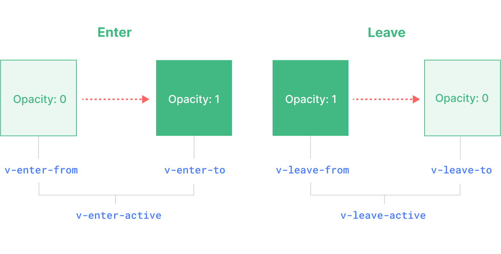

Vue 内置了 `<transition>` 和 `<transition-group>` 组件，在下列情形中，可以给任何元素或组件添加进入/离开的过渡效果：

- `v-if`、`v-show`
- 动态组件 `<component>`
- 组件根节点

## 过渡的类名

在进入/离开的过渡中，会有 6 个 class 切换：

- `v-enter-from`、`v-leave-to`：用于定义元素进入过渡之前、离开过渡之后的隐藏时的状态；
- `v-enter-to`、`v-leave-from`：用于定义元素进入过渡之后、离开过渡之前的显示时的状态；
- `v-enter-active`、`v-leave-active`：用于定义元素进入/离开的过程中的过渡效果，如过渡时间、延迟、曲线函数等。



可以给 `<transition>` 组件添加 `name` 属性，用于自定义过渡的类名，否则类名默认以 `v-` 开头。

```html title="示例"
<template>
  <button @click="flag = !flag">切换</button>
  <transition name="fade">
    <div v-if="flag" class="box"></div>
  </transition>
</template>

<style>
/* 进入过渡之前的状态 */
.fade-enter-from {
  width: 0; height: 0;
  background: red;
  transform: rotate(360deg);
}
/* 进入过渡过程中 */
.fade-enter-active {
  transition: all 2.5s linear;
}
/* 进入过渡完成之后的状态 */
.fade-enter-to {
  width: 200px; height: 200px;
  background: yellow;
}

/* 离开过渡之前的状态 */
.fade-leave-from {
  width: 200px; height: 200px;
  transform: rotate(360deg);
}
/* 离开过渡过程中 */
.fade-leave-active {
  transition: all 1s linear;
}
/* 离开过渡完成之后的状态 */
.fade-leave-to {
  width: 0; height: 0;
}
</style>
```

## 自定义过渡 class 类名

给 `<trasnsition>` 组件添加以下属性，可以自定义过渡的类名。

- `enter-from-class`、`enter-active-class`、`enter-to-class`
- `leave-from-class`、`leave-active-class`、`leave-to-class`

一般会结合第三方 CSS 动画库使用，如 Animate.css：

```shell title="安装"
npm install animate.css --save
```

```js title="引入"
import 'animate.css'
```

```html title="使用"
<transition
  leave-active-class="animate__animated animate__bounceInLeft"
  enter-active-class="animate__animated animate__bounceInRight"
>
  <div v-if="flag" class="box"></div>
</transition>
```

## duration

也可以自定义过渡时间，或分别指定进入和离开的过渡时间，单位是 ms。

```html
<transition :duration="1000">...</transition>
<transition :duration="{ enter: 500, leave: 800 }">...</transition>
```

## 8 个生命周期钩子

```html
@before-enter="beforeEnter" // 对应 enter-from
@enter="enter"  // 对应 enter-active
@after-enter="afterEnter" // 对应 enter-to
@enter-cancelled="enterCancelled" // 显示过渡打断
@before-leave="beforeLeave" // 对应 leave-from
@leave="leave"  // 对应 enter-active
@after-leave="afterLeave" // 对应 leave-to
@leave-cancelled="leaveCancelled" // 离开过渡打断
```

当只用 JavaScript 过渡的时候，在 `enter` 和 `leave` 钩子中必须使用 `done` 进行回调。

```js
const beforeEnter = (el: Element) => {
  console.log('进入之前from', el)
}
const Enter = (el: Element, done: Function) => {
  console.log('过度曲线')
  setTimeout(() => {
    done()
  }, 3000)
}
const AfterEnter = (el: Element) => {
  console.log('to')
}
```

## appear

通过这个属性可以设置初始节点过渡，就是页面加载完成就开始动画。

```html
appear-active-class=""
appear-from-class=""
appear-to-class=""
appear
```

## transition-group

`<transition-group>` 组件的几个特点：

- 默认情况下，它不会渲染一个包裹元素，但是可以通过 `tag` 属性指定渲染一个元素
- 过渡模式不可用，因为我们不再相互切换特有的元素
- 内部元素总是需要提供唯一的 `key` 属性
- CSS 过渡的类将会应用在内部的元素中，而不是这个组/容器本身

```html
<template>
  <transition-group>
    <div v-for="item in list" :key="item">{{ item }}</div>
  </transition-group>
</template>

<script setup lang="ts">
const list = reactive<number[]>([1, 2, 4, 5, 6, 7, 8, 9]);
</script>
```

## 状态过渡

```html
<template>
  <div>
    <input step="20" v-model="num.current" type="number" />
    <div>{{ num.tweenedNumber.toFixed(0) }}</div>
  </div>
</template>

<script setup lang='ts'>
import { reactive, watch } from 'vue';
import gsap from 'gsap';

const num = reactive({
  tweenedNumber: 0,
  current: 0
});

watch(() => num.current, newVal => {
  gsap.to(num, {
    duration: 1,
    tweenedNumber: newVal
  });
});
</script>
```


